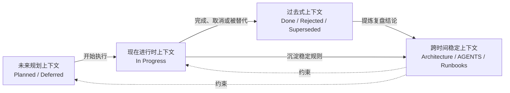

# Loot 时间上下文模型 V0.1

| 属性 | 值 |
|---|---|
| 状态 | Active |
| 版本 | 0.1 |
| 日期 | 2026-07-14 |
| 适用范围 | 项目上下文、需求推进、开发收尾和跨任务接手 |

## 1. 目标

长期 vibe coding 不只需要按文档职责分层，还需要明确一条信息处于哪个时间语义，避免：

- 历史通过结果被误当成当前机器已验证。
- 未来计划被误读为已经实现。
- 当前进行中的临时状态沉积成长期架构规则。
- 已完成事项长期停留在 memory，挤占当前上下文。

时间上下文与目录职责是两个正交维度。本模型不创建三套新目录，而是规定现有文档在不同
生命周期阶段承担什么语义。

## 2. 三类时间上下文

| 类型 | 回答的问题 | 权威载体 | 典型状态 | 更新原则 |
|---|---|---|---|---|
| 过去式上下文 | 已经发生了什么，证据是什么 | development log、reviews、已完成或归档需求 | Done、Rejected、Superseded | 追加证据，归档后不覆盖改写 |
| 现在进行时上下文 | 当前真实状态、正在做什么、阻塞是什么 | development/memory.md、当前需求条目、实时 Git 与运行结果 | In Progress、Blocked | 保持短小，旧状态立即替换或下沉 |
| 未来规划上下文 | 接下来可能做什么、顺序和验收是什么 | planning、architecture open questions | Planned、Deferred | 明确尚未发生，不宣称已验证 |

`architecture`、`AGENTS.md` 和 `runbooks` 是跨时间稳定上下文：它们保存从过去和现在提炼
出的长期规则，并约束现在与未来，但不表达某项任务当前是否完成。

## 3. 生命周期

### 3.1 未来规划进入现在进行时

开始执行一个需求时：

1. 将需求状态从 Planned 或 Deferred 改为 In Progress。
2. 需求状态仍由 planning 中的原条目负责；不把需求正文搬到 memory。
3. 在 `development/memory.md` 记录当前焦点、范围、活跃限制和需求链接。
4. 读取相关 architecture、review 和历史 log，不把全部历史复制进 memory。
5. 用实时 `git status`、runtime 和测试结果确认当前机器状态。

### 3.2 现在进行时沉淀为过去式

任务完成、取消或被替代时：

1. 将需求状态改为 Done、Rejected 或 Superseded，并记录日期和原因。
2. 把判断过程、改动、验证和遗留问题写入季度 development log。
3. 有阶段结论或风险判断时写入 review。
4. 从 memory 删除已经结束的临时状态，只保留仍影响当前工作的结论和链接。
5. 重新选择下一个当前焦点，保持 planning 与 memory 一致。

### 3.3 提炼跨时间稳定上下文

出现以下情况时，把结论晋升到稳定层：

- 同一规则在多个任务中重复出现。
- 结论开始约束后续实现、状态机、契约或模块边界。
- 操作步骤需要跨设备或跨任务重复执行。
- 未来 Codex 若不知道该规则，会产生系统性错误。

稳定边界进入 architecture，强制工作约束进入 AGENTS，可执行步骤进入 runbooks。历史 log
保留当时的证据和链接，不复制新版本全文。

## 4. 一致性规则

1. 过去式上下文必须包含发生日期、结果和证据；历史验证不能冒充当前验证。
2. `development/memory.md` 是项目级当前快照的唯一入口；具体需求状态仍以 planning 原条目为准。
3. Git 分支、工作树、依赖和运行状态必须实时检查，不能只相信 memory 中的旧快照。
4. 未来规划必须使用 Planned 或 Deferred 等显式状态，不能使用“已支持”“已通过”。
5. memory 只保留当前焦点和最近有效验证，不复制完整未来需求清单。
6. 完成事项进入过去式后，从 memory 的活跃区移除，通过索引链接继续可追溯。
7. 归档季度的业务结论不覆盖改写；修正通过新记录、勘误或 superseded_by 表达。
8. architecture 和 runbook 变化时同步更新受影响的现在与未来上下文入口。
9. 三类上下文转换是语义和状态迁移，不要求在目录之间移动同一份需求文档。

## 5. Loot 映射示例

以 `REQ-0006 Crypto Golden Case` 为例：

- 当前它是未来规划上下文，状态为 Planned，定义目标、范围和验收标准。
- 开始实现时改为 In Progress，并进入 memory 的当前焦点。
- 实现和验证期间，memory 只记录活跃状态；详细推理进入当日 development log。
- 通过验收后改为 Done，验证证据进入 log，需要阶段判断时增加 review。
- Golden Case 形成长期 Replay 约束时，将稳定规则写入对应 architecture/testing 设计。

## 6. 健康判定

时间上下文健康需要同时满足：

- memory、当前需求状态和实时 Git 状态不矛盾。
- Planned/Deferred 项没有被描述为已实现。
- Done/Rejected/Superseded 项具有证据或原因链接。
- 当前验证与历史验证清楚区分环境和日期。
- 已结束事项没有继续占用 memory 的活跃上下文。
- 稳定规则不只存在于某一篇历史 log 中。
