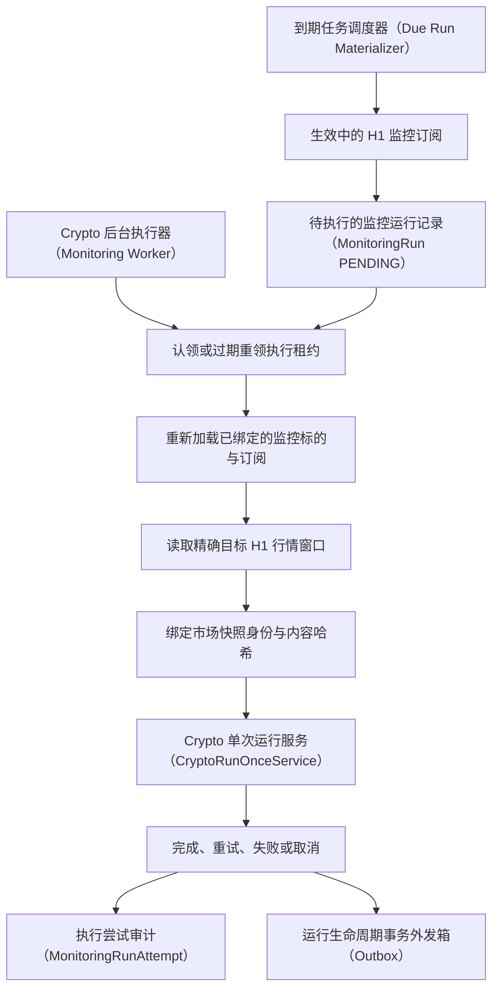
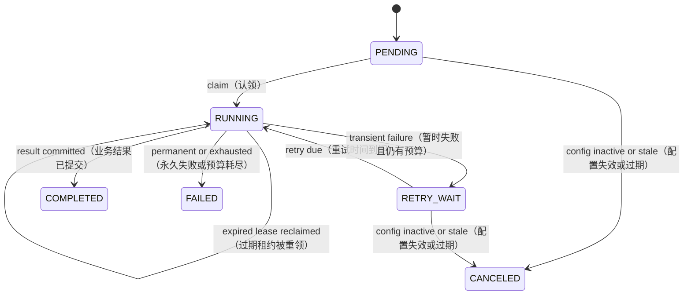

# Loot Crypto 常驻监控 Worker（后台执行器）与运行恢复设计 V0.1

| 属性 | 值 |
|---|---|
| 状态 | Accepted for implementation |
| 实现状态 | Code complete; loot_test 0003 migration and PostgreSQL acceptance pending |
| 版本 | 0.1 |
| 日期 | 2026-07-28 |
| 需求 | REQ-0015 |
| 市场范围 | Crypto H1 |
| 事实源 | PostgreSQL |

## 1. 问题定义

REQ-0014 已经提供持久化 ACTIVE WatchItem（监控标的）和 MonitoringSubscription（监控订阅），
REQ-0013 已经能同步执行一次确定性 Crypto 决策链，但用户仍需手工运行 CLI（命令行入口）。
进程中断、Provider（行情数据提供器）暂时失败或同一 H1 K 线被重复调度时，系统还没有
Run（单周期监控任务）事实、租约、重试预算和恢复入口。

REQ-0015 把单次链路包装为可持续运行的可靠执行层，不改变 Provider、
PreFilter（市场结构预筛选器）、Policy Gate（策略门禁）和
Signal State Machine（信号状态机）的事实所有权。

## 2. 目标与非目标

### 2.1 目标

- 为每个 ACTIVE Crypto H1 Subscription 按精确收盘周期生成稳定
  MonitoringRun（持久化监控运行记录）。
- 以 PostgreSQL Run 账本和追加 Attempt（单次执行尝试）记录表达执行、重试、中断与恢复。
- 复用 CryptoRunOnceService 的确定性业务链，不复制市场判断或授权逻辑。
- 区分业务完成、暂时依赖失败、永久失败和配置失效。
- 在至少一次调度、租约过期和进程重启下保持端到端幂等。

### 2.2 非目标

- 不引入 Redis、Kafka、Celery、Kubernetes、OKX WebSocket 或分布式调度平台。
- 不实现 US Equity、A-Share、Alert（提醒中心）、Replay（历史重放）、
  Agent/LLM（智能体/大语言模型）或自动交易。
- 不保存完整 MarketBar（行情 K 线）/MarketSnapshot（市场快照）历史，也不提供行情图表。
- 不承诺高频或秒级调度；V0.1 只支持 Crypto H1。
- 不让 Worker 直接创建 Ticket（决策授权票据）、更新 Signal（信号实例）或修改 WatchItem 生命周期。

## 3. 权威调用链



Scheduler（调度器）只物化（持久化生成）到期 Run，Worker 只执行已经持久化的 Run。两者都不能
绕过 WatchItem、Subscription、Policy Gate 或 Signal workflow（信号工作流）。

## 4. 时间与稳定身份

### 4.1 H1 收盘目标

- 所有时间使用 UTC aware datetime（带时区信息的 UTC 时间）。
- `target_bar_closed_at` 必须落在整点 H1 边界。
- 调度执行时间为 `target_bar_closed_at + availability_delay`（目标收盘时间加数据可用延迟），
  默认延迟 90 秒，给 Provider 留出发布已收盘 K 线的时间。
- Worker 只能消费 `is_closed=True`、`closed_at == target_bar_closed_at` 且
  `received_at >= closed_at` 的目标 K 线窗口。
- Provider 返回较旧、较新、未闭合或缺少目标 K 线时，不允许静默改用“当前最新”窗口。

### 4.2 Run（运行任务）身份

业务键：

```text
run_key = subscription_id
        + target_bar_closed_at
        + workflow_version
```

- `run_id` 使用上述 canonical run_key（规范化运行键）生成
  UUIDv5（基于命名空间和业务键生成的确定性 UUID）。
- 数据库唯一约束为 `(subscription_id, target_bar_closed_at, workflow_version)`。
- `workflow_version`（工作流版本）表达 Worker 编排、目标窗口和恢复语义版本，V0.1 为
  `crypto.monitoring.h1.v1`。
- `watch_item_version` 和 `subscription_config_version` 在物化 Run 时绑定，进入
  `execution_context_digest`（执行上下文摘要），但不替代 Run 身份。
- 部署新 workflow_version 不自动回放旧周期；是否重跑由未来 Replay 需求显式决定。

### 4.3 Snapshot（市场快照）绑定

首次成功读取目标窗口后，Worker 在继续决策链前把以下值写入 Run：

```text
input_snapshot_id
snapshot_content_hash
source_provider
target_bar_closed_at
```

重试必须重新获取同一目标窗口并核对相同 Snapshot identity（快照身份）和
content hash（内容哈希）。历史修正导致内容变化时，Run 进入 `FAILED / INPUT_CHANGED`，不得在
同一 run_id 下生成第二套业务事实。完整输入保存和数据修正重放属于后续行情留存与 Replay 需求。

## 5. Run（运行任务）状态机



### 5.1 状态语义

| 状态 | 语义 | 终态 |
|---|---|---|
| `PENDING` | Run 已物化，尚未被 Worker 认领 | 否 |
| `RUNNING` | 某个 lease token（租约令牌）当前拥有执行权 | 否 |
| `RETRY_WAIT` | 暂时失败，等待 `next_attempt_at` | 否 |
| `COMPLETED` | 决策链以明确业务结果结束 | 是 |
| `FAILED` | 永久失败或重试预算耗尽 | 是 |
| `CANCELED` | 启动前 WatchItem/Subscription 已失效或版本过期 | 是 |

`COMPLETED` 与业务结果分离。`outcome`（业务结果）使用现有 CryptoRunStatus：

- `NO_CANDIDATE`
- `CANDIDATE_EXPIRED`
- `POLICY_NOT_APPROVED`
- `SIGNAL_TRANSITIONED`

无 Candidate（市场分析候选）是正常完成，不进入重试，也不伪造 Signal。

## 6. 配置变化语义

- Scheduler 只为 ACTIVE WatchItem、ACTIVE Instrument 和 ACTIVE H1 Subscription 物化 Run。
- Worker 在 claim 后、访问 Provider 前重新加载并校验已绑定的 WatchItem version 和
  Subscription config_version。
- PENDING 或 RETRY_WAIT Run 发现 PAUSED、ARCHIVED 或版本不匹配时进入 CANCELED。
- 已进入 RUNNING 的 Run 使用 claim 时绑定的配置完成；用户暂停或归档只阻止后续 Run，
  不删除或回滚正在执行和已经提交的事实。
- 不在外部网络调用期间持有 WatchItem 或 Subscription 行锁。

该规则让“暂停”具有确定的未来生效边界，也避免长事务阻塞用户操作。

## 7. 持久化模型

### 7.1 `monitoring_runs`

保存当前 Run projection（可查询的当前状态投影），至少包含：

```text
id
run_key
subscription_id
watch_item_id
instrument_id
market
timeframe
target_bar_closed_at
workflow_version
execution_context_digest
watch_item_version
subscription_config_version
status
phase
outcome
attempt_count
max_attempts
next_attempt_at
lease_token
lease_owner
lease_expires_at
input_snapshot_id
snapshot_content_hash
source_provider
decision_evaluated_at
candidate_id
proposal_id
policy_evaluation_id
decision_ticket_id
signal_id
last_error_code
created_at
updated_at
completed_at
version
payload
```

结果 ID 只做因果追踪，不让 Run Repository（运行事实仓库）修改对应事实。状态、outcome、
lease（执行租约）字段必须有
组合约束，终态不得保留有效 lease。

`phase` 是跨事务恢复游标：

```text
MATERIALIZED
-> INPUT_BOUND
-> PREFILTERED
-> SIGNAL_INITIALIZED
-> ANALYSIS_PERSISTED
-> POLICY_EVALUATED
-> SIGNAL_APPLIED
-> FINISHED
```

无 Candidate 可以从 PREFILTERED 直接进入 FINISHED；Policy 未批准可以从 POLICY_EVALUATED
进入 FINISHED。phase（阶段恢复游标）只记录已观察到的进度，不替代对应 Repository 中的事实、
Outbox（事务外发箱）和唯一约束。若业务事务已提交而 phase 更新前进程退出，恢复 Worker 以
相同身份重投该阶段，读取首次事实后再推进 phase。

### 7.2 `monitoring_run_attempts`

保存追加式执行证据，至少包含：

```text
id
run_id
attempt_number
lease_token
worker_id
status = STARTED | COMPLETED | FAILED | ABANDONED
started_at
finished_at
error_code
retryable
next_attempt_at
details
```

唯一约束为 `(run_id, attempt_number)`。Attempt 不覆盖历史；租约过期后旧 Attempt 标记
`ABANDONED`，新 Worker 创建下一次 Attempt。

### 7.3 Subscription 调度游标

复用 MonitoringSubscription 的 `next_run_at`，它表达下一个目标周期的执行时间，不是用户配置
版本。Scheduler 更新它时：

- 按 WatchItem 后 Subscription 的固定锁顺序重载投影。
- 同一事务插入 Run 并推进 `next_run_at`，任一步失败整体回滚。
- 更新 Subscription 完整 payload 和 `updated_at`，但不提升 `config_version`。
- 生命周期变更仍提升 `config_version`；调度游标变化不能伪装成用户配置变化。

## 8. 调度与认领事务

### 8.1 物化到期 Run

Scheduler 先无锁发现候选，再逐个使用短事务：

1. 按稳定身份获取 transaction advisory lock。
2. 按 WatchItem、Subscription 顺序 `SELECT ... FOR UPDATE`。
3. 重检 ACTIVE、Crypto、H1、版本和 `next_run_at <= database_now`。
4. 以 deterministic run_id 执行 `INSERT ... ON CONFLICT DO NOTHING`。
5. 推进 Subscription `next_run_at` 到下一 H1 周期。
6. 写入 `MonitoringRunScheduled` Outbox 并提交。

初次 `next_run_at IS NULL` 时，从当前数据库时间推导最近一个已满足 availability delay 的 H1
收盘周期。单次 tick 每个 Subscription 最多物化 24 个遗漏周期，超出部分保留游标等待下轮，
防止长时间停机后形成无界事务。

### 8.2 claim（任务认领）与 lease reclaim（租约过期重领）

Worker 使用 `FOR UPDATE SKIP LOCKED`（锁定候选行并跳过已被其他 Worker 锁定的行），并且只
认领与当前进程 `workflow_version` 完全一致的 Run。它选择：

- 到期 PENDING；
- 到期 RETRY_WAIT；
- lease 已过期的 RUNNING。

claim 事务原子更新 RUNNING、lease_token、lease_owner、lease_expires_at、attempt_count 和
version（乐观锁版本），
同时插入 STARTED Attempt；reclaim 还要把旧 lease 对应的 STARTED Attempt 标记为 ABANDONED。
V0.1 默认 lease 5 分钟；所有完成、重试和失败更新必须匹配当前
`lease_token + version`，失去 lease 的 Worker 不能覆盖新 owner（租约持有者）的结果。
物化使用 `INSERT ... ON CONFLICT DO NOTHING RETURNING id` 判断是否首次创建，禁止依赖数据库
驱动的 `rowcount` 推断插入结果。

租约只避免正常情况下重复执行，不是最终幂等保证。进程暂停或数据库抖动可能使两个 Worker
短暂重叠，Candidate、Analysis（分析结果）、Policy（策略评估）、Ticket、Signal 和 Outbox 的
既有唯一键与 payload（业务载荷）
指纹仍是最终保护。

## 9. 执行与恢复

Worker 认领后按以下顺序执行：

1. 加载并校验绑定配置；失效则 CANCELED。
2. 按 `target_bar_closed_at` 获取精确窗口。
3. 首次绑定或重试核对 Snapshot identity/content hash。
4. 使用稳定 `run_id`、绑定版本和 execution_context_digest 调用可恢复的 CryptoRunOnceService。
5. 每个已提交阶段后推进 phase；checkpoint（恢复检查点）落后时重投同一阶段并恢复首次事实。
6. 将业务结果和事实 ID 写回 COMPLETED，并完成 Attempt 和 Outbox。

### 9.1 阶段输入一次绑定

凡是进入下游 payload、指纹或稳定请求身份的值，都必须在首次进入该阶段前写入 Run，并在重试时
复用，禁止重新读取墙上时钟或生成随机 ID。至少包括：

```text
run_id
input_snapshot_id
snapshot_content_hash
execution_context_digest
decision_evaluated_at
各阶段 request/correlation identity（请求身份/链路关联身份）
```

`decision_evaluated_at` 在首次进入 Policy 阶段前按真实 UTC 时间绑定；重试相同 Policy 阶段时
继续使用该值。Attempt 的 started_at/finished_at 记录每次真实尝试时间，可以变化，但不得进入
Proposal（决策提案）、PolicyEvaluation（策略评估记录）、Ticket 或 Signal 的业务指纹。

如果恢复时 Ticket 已签发但尚未消费且已经过期，Run 进入 `FAILED / AUTHORIZATION_EXPIRED`，
不得伪造新的 evaluated_at 或在同一 Run 下补签 Ticket。若阶段 checkpoint 落后，Worker 应先从
事实仓库按稳定阶段身份协调已存在结果，再决定是否继续，不能只根据 phase 猜测事实不存在。

实现阶段需要为 Provider 增加“截至精确 closed_at 的窗口”能力，不能用当前
`fetch_recent_bars()` 替代历史补跑。CryptoRunOnceService 应允许消费已加载 Snapshot，并把
现有调用链拆成可使用稳定阶段身份重复进入的内部执行器；CLI 仍可调用同一执行器一次跑完，
业务判断逻辑不得复制到 Worker。

进程在任一决策阶段后中断时，新 Worker 使用同一 run_id 和相同 Snapshot 重新进入完整链路。
现有阶段幂等身份负责返回首次事实或完成缺失阶段，不执行删除补偿。

## 10. 失败分类与重试

| 分类 | 示例 | 行为 |
|---|---|---|
| 业务完成 | 无 Candidate、Policy 未批准 | COMPLETED，不重试 |
| 暂时依赖失败 | timeout、429、5xx、目标 K 线暂未发布 | RETRY_WAIT |
| 数据输入冲突 | 重试时 Snapshot content 改变 | FAILED / INPUT_CHANGED |
| 配置失效 | PAUSED、ARCHIVED、版本不匹配 | CANCELED |
| 契约或身份冲突 | 非 H1、route（市场路由）错误、稳定 ID payload 冲突 | FAILED |
| 重试耗尽 | 暂时错误超过 max_attempts | FAILED / RETRY_EXHAUSTED |

当前边界：Signal 的 `expires_at` 已过但事实状态仍为 OBSERVING/ARMED 时，它仍属于活跃
generation，新 setup 会被 Signal workflow 拒绝。Worker 只能记录失败，不能绕过 Policy Gate
或 Signal State Machine 直接把旧 Signal 改为 EXPIRED；到期收敛属于后续 Signal 生命周期设计。

默认最大 5 次 Attempt；退避使用确定性序列 `30s, 2m, 5m, 15m`，最后一次失败直接进入
FAILED。错误只保存稳定 `error_code` 和脱敏摘要，不保存 DSN、口令或完整 SQL。

## 11. 事件与可观测性

最小 Outbox 事件：

- `loot.monitoring.RunScheduled`
- `loot.monitoring.RunCompleted`
- `loot.monitoring.RunRetryScheduled`
- `loot.monitoring.RunFailed`
- `loot.monitoring.RunCanceled`

事件 ID 绑定 run_id、目标状态和状态 version；重投不得产生第二条不同 payload。事件包含 run_id、
subscription_id、target_bar_closed_at、workflow_version、attempt、outcome/error_code 和结果事实 ID。

Worker 日志至少携带：

```text
run_id
subscription_id
watch_item_id
target_bar_closed_at
workflow_version
attempt_number
lease_owner
input_snapshot_id
correlation_id
```

Runtime Console（运行监控页面）扩展不属于本需求；数据库和 CLI 摘要足以完成 V0.1 验收。

## 12. 模块与端口

计划模块：

```text
src/loot/contracts/monitoring_run.py     Run 与 Attempt 强类型契约
src/loot/application/monitoring.py       调度、claim、execute 用例
src/loot/persistence/monitoring.py       PostgreSQL Run Repository
src/loot/domains/crypto/market_data.py   精确目标窗口 Provider 能力
scripts/run_crypto_worker.py             --once / --loop 入口
```

`--once` 用于测试和人工验收，`--loop` 才是常驻模式。V0.1 单进程即可运行，但 Repository
必须按多 Worker 语义实现和测试。

## 13. 测试与验收

必须覆盖：

1. 同一 Subscription/closed_at/workflow 重复物化只产生一个 Run。
2. 只消费精确已收盘目标 K 线，较旧、较新和未闭合窗口均拒绝。
3. ACTIVE 成功执行；PAUSED、ARCHIVED 和版本过期在 Provider 前取消。
4. NO_CANDIDATE 为 COMPLETED，且不产生 Signal 噪声。
5. Provider 暂时失败按退避重试，永久失败和预算耗尽进入 FAILED。
6. lease 未过期不能重复 claim；lease 过期可由新 worker 恢复。
7. 旧 lease token 不能覆盖新 owner 的状态。
8. 中断后重跑完整链不会重复 Candidate、Ticket、SignalTransition 或 Outbox。
9. Snapshot 内容变化在同一 run_id 下按 INPUT_CHANGED 拒绝。
10. 每个阶段提交后、phase 更新前模拟中断，恢复后读取首次事实并继续。
11. 相同阶段跨 Attempt 重试时，payload 时间和 request identity 保持不变，Attempt 时间正常推进。
12. `loot_test` 真实 PostgreSQL、进程重启和至少两个并发 Worker 集成测试。

验收前先在 `loot_test` 执行增量 SQL；不得用内存测试代替租约、`SKIP LOCKED`、唯一约束和
事务回滚验证。

## 14. Rollout（上线启用）与回退

1. 先部署 migration 和 `--once`，只对现有 BTC-USDT H1 Subscription 验收。
2. 使用 demo/targeted fake provider（演示模式/指定窗口的模拟数据提供器）验证成功、
   无 Candidate、重试和恢复。
3. live `--once` 通过后再启动单进程 `--loop`。
4. 发现异常时停止 Worker，不删除 Run、Attempt 或下游事实；修复后按 lease/retry 语义恢复。
5. 不提供破坏性 downgrade（降级迁移）；生产数据修复使用新的前向 migration（数据库迁移）。
