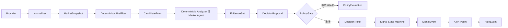

# Loot 决策运行时与授权链路设计 V0.1

| 属性 | 值 |
|---|---|
| 状态 | Accepted |
| 版本 | 0.1 |
| 日期 | 2026-07-14 |
| 适用范围 | Candidate 到 Signal 的跨模块决策链路 |
| 依赖 | 系统宏观架构、核心契约、Signal State Machine |

## 1. 问题定义

Loot 已经明确 Agent 不能直接修改 Signal，Signal State Machine 只消费通过
Policy Gate 的输入。但早期文档和代码把 `DecisionTicket` 同时用于两种语义：

- Policy Gate 之前的“待审核建议”。
- Policy Gate 之后的“已授权状态迁移凭证”。

这会让调用方无法仅凭类型判断输入是否经过授权，也会给未来的确定性
decision builder、Agent、Replay 和持久化留下绕过 Policy Gate 的路径。

本设计将两个阶段拆成不同契约：

```text
DecisionProposal = 待审核提案
DecisionTicket   = Policy Gate 签发的授权凭证
```

## 2. 目标与非目标

### 2.1 目标

- 固定 Candidate 到 Signal 的唯一合法链路。
- 明确 Agent、Skill、Policy Gate、State Machine 和 Alert 的权限边界。
- 定义 Proposal、PolicyEvaluation、Ticket 的最小语义。
- 定义事务、幂等、失败、Replay 和追踪规则。
- 允许第一条 Crypto 闭环使用确定性组件，不依赖 Agent 或 LLM。

### 2.2 非目标

- 不在本设计中定义具体突破算法和阈值。
- 不实现自动交易、账户连接或交易指令。
- 不要求当前阶段立即接入 PostgreSQL、Redis 或真实提醒渠道。
- 不统一三个市场的业务规则、Session 或 TransitionPolicy。
- 不引入复杂工作流引擎或多 Agent 框架。

## 3. 权威运行链路



硬约束：

1. `DecisionProposal` 不能直接进入 Signal State Machine。
2. `DecisionTicket` 只能由 Policy Gate 签发。
3. Policy Gate 无论通过、拒绝还是延后，都必须产生可审计的
   `PolicyEvaluation`。
4. 只有 `APPROVED` 的 PolicyEvaluation 才能对应一个 DecisionTicket。
5. Signal State Machine 是 Signal 状态的唯一写入入口。
6. Alert 只消费 SignalEvent，不能反向修改 Signal。

## 4. 核心对象职责

| 对象 | 业务含义 | 创建者 | 是否能改变 Signal |
|---|---|---|---|
| `MarketSnapshot` | 标准化后的市场输入窗口 | Provider / Normalizer | 否 |
| `CandidateEvent` | 值得继续分析的确定性事实 | Market PreFilter | 否 |
| `EvidenceSet` | 版本化 Skill 或确定性分析证据 | Skill Runtime / Analyzer | 否 |
| `DecisionProposal` | 基于证据提出的状态迁移建议 | Decision Skill / Deterministic Builder | 否 |
| `PolicyEvaluation` | 对提案的准入结果和理由 | Policy Gate | 否 |
| `DecisionTicket` | 已授权、有限期、不可变的迁移凭证 | Policy Gate | 只能作为状态机输入 |
| `SignalInstance` | Signal 当前投影 | Signal State Machine | 状态机内部 |
| `SignalEvent` | 已发生的状态变化事实 | Signal State Machine | 否 |
| `AlertEvent` | 基于 SignalEvent 生成的提醒任务 | Alert Policy | 否 |
| `PositionEvent` | 用户手工持仓操作事实 | Portfolio 命令入口 | 否 |

`CandidateEvent` 不是 Signal，`EvidenceSet` 不是命令，`DecisionProposal`
不是授权，`SignalEvent` 也不是可修改的状态对象。

## 5. 决策权限模型

### 5.1 Deterministic Analyzer 与 Market Agent

两者都只能：

- 读取 Context Builder 提供的有限上下文。
- 生成 EvidenceSet。
- 生成 DecisionProposal。

两者都不能：

- 创建 DecisionTicket。
- 调用 Signal State Machine 绕过 Policy Gate。
- 直接修改 SignalInstance、Position 或提醒状态。
- 发出交易指令。

第一条最小闭环使用 `DeterministicDecisionBuilder`。未来接入 Market Agent 时，
只替换“如何选择和组合分析路径”，不改变 Proposal 之后的授权链路。

### 5.2 Policy Gate

Policy Gate 负责：

- 校验证据是否存在、未过期且来自允许的版本。
- 校验数据质量、市场规则和 TransitionPolicy。
- 校验 WatchItem、TradingPlan、Position 和 Signal 版本与 Proposal 绑定的上下文一致。
- 防止提案跨市场、跨标的、跨周期或跨 Signal 生效。
- 记录批准、拒绝或延后的原因。
- 仅在批准时签发 DecisionTicket。

V0.1 的 Policy Gate 不修改 Proposal。需要降低优先级、改变目标状态或替换证据时，
必须生成新的 Proposal，避免审核前后语义被静默篡改。

### 5.3 Signal State Machine

Signal 在开始监控某个 WatchItem、timeframe 和 SignalType 时，由状态机的初始化入口
幂等创建为 `OBSERVING`。初始化由 MonitoringSubscription 生命周期触发，不需要
DecisionTicket，因为它不表达市场判断；Agent、Skill、PreFilter 和 Decision Builder
都不能创建 Signal。初始化之后的任何状态变化都必须持有效 DecisionTicket。

状态机只负责：

- SignalInstance 的幂等初始化。
- 通过 AuthorizationRepository 加载 Ticket、PolicyEvaluation 和 Proposal，验证完整
  授权链；生产适配器使用 PostgreSQL，Phase 0 测试可使用内存适配器。
- Ticket 幂等消费和完整 payload 指纹冲突检测。
- Ticket 与当前 Signal 身份匹配。
- Ticket 有效期、`expected_signal_version` 和 `context_digest` 校验。
- 合法迁移表校验。
- 通过完整模型校验重建 SignalInstance 投影，禁止绕过契约 validator。
- 写入 SignalTransition 和 SignalEvent。

市场业务条件由各 Market Domain 的 TransitionPolicy 定义。共享状态机引擎只执行
机械迁移，不把三个市场抽成一套业务规则。

## 6. 契约语义

### 6.1 DecisionProposal

最小字段：

```text
id
candidate_event_id
market
instrument_id
timeframe
signal_type
signal_id
suggested_transition
evidence_refs
skill_versions
rule_version
actionability
position_impact
invalidation
next_check_at
input_snapshot_id
expected_signal_version
watch_item_version
trading_plan_config_version
position_version
context_digest
decision_summary
created_at
dedupe_key
```

规则：

- `evidence_refs`、`skill_versions` 和 `input_snapshot_id` 必须可追溯。
- CandidateType 到 SignalType 的映射由 Market Domain 确定性规则完成；一个 Candidate
  可以形成多个 Proposal，但每个 Proposal 只能指向一个明确的 signal_id 和
  signal_type。
- `dedupe_key` 至少绑定 Candidate、signal_id、expected_signal_version、规则版本、
  目标状态和 context_digest。
- Proposal 写入后不可修改；修正必须产生新 Proposal。
- Deterministic Builder 也必须写明 `rule_version`，不能用“没有模型”代替版本管理。

### 6.2 PolicyEvaluation

最小字段：

```text
id
evaluation_request_id
proposal_id
outcome = APPROVED | REJECTED | DEFERRED
policy_version
proposal_digest
evaluation_context_digest
attempt_number
guard_results
reason_codes
evaluated_at
expires_at
next_check_at
dedupe_key
```

规则：

- 每个 Guard 都要保留结构化结果，不能只存一段自由文本。
- 相同 `evaluation_request_id` 的重复投递必须返回首次结果。
- 相同 Proposal、Policy 版本和 evaluation_context_digest 只能形成一个评估事实。
- evaluation_context_digest 至少绑定 Proposal digest、Policy 版本、Signal/业务版本、
  数据质量输入和本次评估时间窗口；DEFERRED 到期后的计划评估使用新的 request ID 和
  evaluation context。
- PolicyEvaluation 只追加不修改；上下文变化或 DEFERRED 到期后创建新的评估尝试。
- `REJECTED` 和 `DEFERRED` 不签发 DecisionTicket。
- `DEFERRED` 必须通过 `next_check_at` 给出下一次允许评估的时间，或在结构化
  reason_codes 中写明触发条件。

### 6.3 DecisionTicket

最小字段：

```text
id
proposal_id
policy_evaluation_id
policy_version
proposal_digest
market
instrument_id
timeframe
signal_id
authorized_transition
actionability
position_impact
input_snapshot_id
expected_signal_version
watch_item_version
trading_plan_config_version
position_version
context_digest
issued_at
expires_at
dedupe_key
```

规则：

- Ticket 只能引用 outcome 为 `APPROVED` 的 PolicyEvaluation。
- `proposal_digest` 锁定审核时的 Proposal 内容，防止审核后替换字段。
- 状态机必须通过事实仓库端口核对 PolicyEvaluation 为 `APPROVED`，并校验
  proposal_digest、policy_version 和上下文版本；生产使用 PostgreSQL，不能仅信任
  调用方传入的对象。
- `authorized_transition` 是状态机唯一读取的目标状态。
- Ticket 必须有有效期；过期 Ticket 不能改变 Signal。
- 一个 Proposal 在整个生命周期内最多签发一张 Ticket；Policy 版本变化后如需重新
  授权，必须创建新 Proposal，避免多张有效 Ticket 并存。
- Ticket 写入后不可修改、不可重新解释。

## 7. Position 与市场信号的边界

市场结构是否成立不能由用户是否持仓决定：

```text
MarketSnapshot -> Candidate -> Evidence -> Proposal -> Signal
Position       -> Policy 上下文 / 优先级 / Alert 语义
```

V0.1 Crypto `STRUCTURE_BREAKOUT` Golden Case 不读取 Position。Position 可以影响：

- 该信号对用户是否可操作。
- 风险提醒优先级。
- position_impact 和提醒文案。

未来“接近止损”等持仓专属监控应使用独立的风险候选或 SignalType，不能修改同一
市场结构信号的真假。

## 8. 因果链与追踪标识

事件信封统一携带：

```text
event_id
correlation_id
causation_id
producer
occurred_at
partition_key
```

对象之间必须保留直接引用：

```text
snapshot_id
-> candidate_event_id
-> evidence_set_id / skill_run_id
-> decision_proposal_id
-> policy_evaluation_id
-> decision_ticket_id
-> signal_transition_id / signal_event_id
-> alert_id
```

规则：

- 一次监控触发沿用同一个 `correlation_id`。
- 每个新事件的 `causation_id` 指向直接触发它的事件。
- Replay 可以生成新的 correlation_id，但必须保留原始 input_snapshot_id 和
  replay_run_id。
- 业务幂等不能只依赖 correlation_id；必须使用各对象的稳定 dedupe_key。

## 9. 事务与幂等边界

### 9.1 Candidate 事务

```text
写入 CandidateEvent
+ 写入 OutboxEvent
+ Candidate dedupe 唯一约束
```

建议唯一键：

```text
(market, instrument_id, timeframe, candidate_type, dedupe_key)
```

### 9.2 Signal 初始化事务

```text
按监控身份和 generation 幂等创建 OBSERVING SignalInstance
+ 写入初始化审计记录
+ 写入 OutboxEvent
```

初始化规则：

- `latest_decision_ticket_id` 初始为 null。
- `generation` 从 1 开始，`setup_key` 标识本轮信号结构。
- 同一监控身份同一时刻最多一个非终态 Signal，使用 partial unique index 约束。
- Signal 到达 INVALIDATED、RESOLVED 或 EXPIRED 后，新 setup_key 可以通过状态机
  初始化下一代 OBSERVING Signal；Agent、Skill 和 PreFilter 仍不能直接创建。
- 建议唯一键为
  `(watch_item_id, market, instrument_id, timeframe, signal_type, generation)`。

### 9.3 Evidence 与 Proposal 事务

```text
写入 SkillRun / EvidenceSet
+ 写入 DecisionProposal
+ 写入 OutboxEvent
+ Proposal dedupe 唯一约束
```

Evidence 已写入但 Proposal 未生成时允许按同一分析请求恢复，不允许伪造缺失 Evidence。

### 9.4 Policy 事务

```text
写入 PolicyEvaluation
+ APPROVED 时写入 DecisionTicket
+ 写入 OutboxEvent
+ evaluation_request_id 唯一约束
+ proposal_id + policy_version + evaluation_context_digest 唯一约束
+ DecisionTicket.proposal_id 唯一约束
```

### 9.5 Signal 迁移事务

```text
登记 DecisionTicket 消费
+ 从事实源校验 Proposal / PolicyEvaluation / Ticket 授权链
+ 校验 expected_signal_version 和 context_digest
+ 更新 SignalInstance
+ 写入 SignalTransition
+ 写入 SignalEvent Outbox
```

这些操作必须在同一个 PostgreSQL 事务内完成。Redis Streams 只负责投递，不能成为
Signal 状态或幂等事实源。

建议唯一约束：

```text
decision_ticket_consumption(decision_ticket_id)
signal_transition(signal_id, decision_ticket_id)
outbox(event_id)
```

## 10. 失败处理

| 失败点 | 行为 | 是否继续下游 |
|---|---|---|
| Snapshot 不完整或乱序 | 标记数据质量失败，保留输入 | 否 |
| PreFilter 失败 | 记录错误，等待下一周期或 Replay | 否 |
| Skill / Analyzer 超时 | SkillRun 记为 FAILED | 否 |
| Proposal 契约失败 | 拒绝写入并记录生产者错误 | 否 |
| Policy REJECTED | 保存原因 | 否 |
| Policy DEFERRED | 安排 next_check_at | 否 |
| Ticket 过期 | 状态机拒绝并记录 | 否 |
| 授权链或 digest 不匹配 | 拒绝 Ticket 并记录安全审计 | 否 |
| Signal 或上下文版本冲突 | 重新生成 Proposal 并重新评估，不盲目重试迁移 | 否 |
| Outbox 发布失败 | 保留未发布记录并重试 | 事务已提交 |
| Alert 投递失败 | 独立重试 | 不回滚 Signal |

任何降级都不能伪造 Evidence、跳过 Policy Gate 或把失败当作已批准。

## 11. Golden Case 与 Replay 顺序

Golden Case 是可执行业务定义，应先于 PreFilter 实现。第一批 Crypto 样例固定为：

1. 普通上涨但未突破，不产生 Candidate。
2. 已收盘 K 线确认突破，产生 `STRUCTURE_BREAKOUT` Candidate。
3. 未收盘 K 线盘中突破，不产生 Candidate。
4. 同一快照重复处理，Candidate dedupe_key 稳定。
5. Policy 拒绝 Proposal，不产生 DecisionTicket 和 SignalEvent。
6. Policy DEFERRED 到期且上下文变化后，可以追加新的评估结果。
7. 同一 DecisionTicket 重复消费，只产生一次 SignalEvent。
8. 相同 Ticket ID 但 payload 指纹不同，必须按冲突拒绝。

最小 Replay 路径：

```text
固定 MarketSnapshot
-> 固定 Candidate 预期
-> 固定 DecisionProposal 预期
-> 固定 PolicyEvaluation 预期
-> 固定 DecisionTicket 预期
-> 固定 SignalTransition 预期
```

## 12. 模块归属

```text
src/loot/contracts/              跨模块契约
src/loot/domains/crypto/         Crypto PreFilter、Analyzer、Policy
src/loot/domains/us_equity/      US Equity 专属实现
src/loot/domains/a_share/        A-Share 专属实现
src/loot/signals/                共享状态机机械引擎
src/loot/persistence/            Inbox、Outbox、Repository、事务
src/loot/notifications/          Alert Policy 和 Notifier
```

三个 Market Domain 禁止直接依赖。共享 contracts 只表达协议，不承载市场业务规则。

## 13. 实施顺序

1. 先修复 Snapshot 身份、闭合时间和状态机投影校验等已复现地基问题。
2. 固化 Crypto Golden Case 输入和预期。
3. 实现只读取 `latest_closed_bar` 的 Crypto PreFilter。
4. 实现 OBSERVING SignalInstance 的幂等初始化和 generation 规则。
5. 将现有 Policy 前的 `DecisionTicket` 契约迁移为 `DecisionProposal`。
6. 增加可重评的 `PolicyEvaluation` 和最小 Policy Gate。
7. 增加绑定上下文版本的 Policy 后 `DecisionTicket` 契约。
8. 让 Signal State Machine 从事实源验证授权链后执行迁移。
9. 补拒绝、延后重评、重复投递、过期 Ticket、上下文冲突和恢复路径测试。
10. 再落地持久化 Inbox、Outbox 和乐观锁。
11. 最后接入 Agent、Alert 和真实调度。

契约迁移期间不得同时保留两个同名但不同语义的 DecisionTicket。

## 14. 验收标准

- 从类型和创建者可以判断对象是否经过 Policy 授权。
- 初始 OBSERVING Signal 只能由状态机初始化入口幂等创建。
- 终态后可以用新 generation 初始化下一轮信号，且同一身份只有一个活跃代。
- 没有 PolicyEvaluation 的 Proposal 无法产生 DecisionTicket。
- REJECTED 或 DEFERRED 不会触发 Signal State Machine。
- DEFERRED 可以在新评估上下文中重试，重复投递仍保持幂等。
- 同一 Proposal 不会签发多张 Ticket。
- Ticket 必须绑定授权时的 Signal 和业务上下文版本。
- 状态机必须验证持久化授权链，不能信任可任意构造的 Ticket 对象。
- 同一 Ticket 重复消费不会产生重复 SignalEvent。
- 相同 Ticket ID 但内容不同必须拒绝，不能当作正常重复投递。
- Position 不改变市场结构 Signal 的真假。
- 核心链路可以从 snapshot_id 追踪到 alert_id。
- Golden Case、架构文档、契约和实现使用相同术语。
