# Loot 智能决策闭环机制 V0.1

| 属性 | 值 |
|---|---|
| 状态 | Proposed，实施 Deferred |
| 版本 | 0.1 |
| 适用范围 | Crypto First Vertical Slice；未来扩展到其他市场时分别实现领域适配器 |
| 核心机制 | 上下文机制、状态机制、决策机制、执行反馈闭环 |
| 实施门槛 | Crypto 监控、事实留存、最小 Replay 和确定性基线评测完成后，先 Shadow Mode |

## 1. 设计定位

Loot 的 Agent 不是一个拥有长期记忆和业务写权限的聊天机器人，而是受控智能决策闭环中的
一个可替换决策编排器。闭环必须回答四个问题：

1. **上下文机制**：这一轮允许分析什么事实？这些事实来自哪里、哪个版本、哪个时间窗口？
2. **状态机制**：监控、运行、Signal、Alert 和人工持仓当前处于什么状态？谁拥有写权限？
3. **决策机制**：如何从候选事实和受控 Skill 形成 `DecisionProposal`，并通过 Policy Gate？
4. **执行反馈闭环**：分析运行、提醒投递、用户动作和历史结果如何成为下一轮的可追踪事实？

这四类机制不是四个互相独立的服务，而是一个有明确事实源、状态边界和因果链的控制闭环。

## 2. 总体流程架构

```mermaid
flowchart LR
    T["触发：已收盘 K 线 / 用户动作 / 重评时钟"] --> CR["Context Build Request"]

    subgraph STATE["状态机制：事实源与状态机"]
        DB[("PostgreSQL 事实源")]
        RS["Monitoring / Run 状态"]
        SS["Signal State Machine"]
        AS["Alert / Delivery 状态"]
        PS["Position / PositionEvent 投影"]
        DB --> RS
        DB --> SS
        DB --> AS
        DB --> PS
    end

    subgraph CONTEXT["上下文机制：确定性 Context Builder"]
        LOAD["按身份加载事实"]
        VALIDATE["校验时间、版本、市场和权限"]
        SELECT["按任务选择上下文分区与预算"]
        CANON["规范化序列化并生成 context_digest"]
        SNAP["持久化 Context Envelope"]
        LOAD --> VALIDATE --> SELECT --> CANON --> SNAP
    end

    CR --> LOAD
    DB --> LOAD

    subgraph DECISION["决策机制：Agent / Deterministic Builder"]
        ROUTE["确定性市场路由"]
        AGENT["Market Agent 或 Deterministic Builder"]
        SKILLS["Skill Runtime：精确版本、allowlist、超时、审计"]
        EVIDENCE["EvidenceSet"]
        PROPOSAL["DecisionProposal"]
        ROUTE --> AGENT
        AGENT --> SKILLS --> EVIDENCE --> PROPOSAL
    end

    SNAP --> ROUTE
    PROPOSAL --> POLICY["Policy Gate：事实源重读与授权校验"]
    DB --> POLICY
    POLICY -->|"REJECTED / DEFERRED"| AUDIT["审计并结束或等待重评"]
    POLICY -->|"APPROVED"| TICKET["DecisionTicket"]
    TICKET --> SS
    SS --> EVENT["SignalTransition / SignalEvent"]

    subgraph FEEDBACK["执行反馈闭环"]
        ALERT["Alert Policy / Notifier"]
        ACK["ACK / IGNORE / 人工 PositionEvent"]
        OUTCOME["Replay 结果标签：MFE / MAE / 先止损或先目标"]
        ALERT --> ACK
        ACK --> OUTCOME
    end

    EVENT --> ALERT
    EVENT --> DB
    ACK --> DB
    OUTCOME --> DB
    DB -. "下一轮只读取已落库事实" .-> CR

    AGENT -. "禁止直接写入" .-> SS
    AGENT -. "禁止直接创建" .-> TICKET
```



关键方向是：**状态事实进入上下文，上下文约束决策，决策只能产生提案，授权后才执行状态迁移，
执行结果再沉淀为下一轮事实**。Agent 不拥有任何事实状态的最终写权限。

## 3. 四大机制边界

### 3.1 上下文机制

Context Builder 是确定性组件，不由 Agent 决定自己读取哪些数据库表，也不允许把整库或无限历史
直接塞进模型。

上下文输入按以下优先级组织：

| 分区 | 内容 | 权威来源 | 版本要求 |
|---|---|---|---|
| Identity | `correlation_id`、`run_id`、market、instrument、timeframe、触发原因 | Run / WatchItem | 必须存在 |
| Market Facts | 已收盘 K 线、MarketSnapshot、Data Quality 结果、Candidate | Provider / Snapshot / Candidate | `input_snapshot_id` 和内容摘要 |
| Business State | WatchItem、TradingPlan、Position、PositionEvent 投影 | PostgreSQL | 配置版本和投影版本 |
| Signal State | 当前 Signal、generation、state、expected version、最近迁移 | Signal State Machine | Signal version |
| Capability | 允许调用的 Skill ID、精确版本、timeout、capability | Skill Registry / Policy | manifest digest |
| Feedback | 相关 Alert 投递、用户 ACK/IGNORE、历史结果标签 | Alert / Replay | 只读、带因果引用 |

Context Envelope 至少包含：

```text
context_id
schema_version
correlation_id
run_id
market
instrument_id
timeframe
as_of
expires_at
source_refs[]
watch_item_version
trading_plan_config_version
position_version
signal_version
input_snapshot_id
skill_allowlist[]
section_budgets
context_digest
```

上下文构建必须经过：

1. 根据 `watch_item_id`、`run_id` 和触发原因确定任务身份。
2. 从事实源读取对象并校验市场、标的、周期和时间窗口一致。
3. 拒绝未收盘 K 线、过期配置、版本冲突和不属于当前用户或监控项的事实。
4. 按固定分区和预算选择内容，超预算时使用确定性裁剪规则并留下摘要。
5. 使用规范化序列化生成 `context_digest`，持久化 Envelope 和来源引用。
6. 将不可变 Envelope 交给 Agent 或确定性 Builder；运行期间不得静默修改输入。

项目 docs、运行时业务上下文和模型工作区必须分开：

- `docs/` 是开发者和 Codex 的项目上下文，不直接作为用户业务事实注入 Agent。
- PostgreSQL 中的业务事实是运行时上下文的权威来源。
- Agent 的临时 scratchpad 不是事实源，V1 不提供自由格式长期 Agent Memory。
- 模型内部推理过程不作为业务状态或反馈事实保存。

### 3.2 状态机制

状态机制负责回答“事实当前是什么”和“谁可以改变它”，不负责替 Agent 解释市场。

| 状态对象 | 当前事实源 | 唯一写入边界 |
|---|---|---|
| WatchItem / Subscription | PostgreSQL | Watchlist application service |
| Monitoring Run | PostgreSQL Run ledger | Worker / recovery service |
| SignalInstance | PostgreSQL + Signal State Machine | Signal State Machine |
| PolicyEvaluation / DecisionTicket | PostgreSQL | Policy Gate |
| Alert / Delivery | PostgreSQL | Alert Center |
| Position / PositionEvent | PostgreSQL | Portfolio command service |
| Agent Run / SkillRun | PostgreSQL 或审计适配器 | Agent Runtime / Skill Runtime |

状态必须区分三类版本：

- **事实版本**：MarketSnapshot、Candidate、SkillRun 等已经发生的不可变事实。
- **业务投影版本**：WatchItem、TradingPlan、Position、Signal 的当前版本。
- **运行版本**：Run、AgentRun、AlertDelivery 的尝试、重试和恢复状态。

Agent 只能读取状态快照并携带版本，不得把“模型认为的新状态”直接写回状态对象。所有状态变化
必须通过对应命令、Policy Gate、Signal State Machine 或 PositionEvent 入口完成。

### 3.3 决策机制

决策机制包含确定性分析器和未来的 Market Agent，但两者共享同一份 Proposal、Policy 和 Signal
授权契约：

```text
Candidate
  -> Context Envelope
  -> Market Agent / Deterministic Builder
  -> exact-version Skill Runs
  -> EvidenceSet
  -> DecisionProposal
  -> PolicyEvaluation
  -> DecisionTicket
  -> Signal State Machine
```

规则：

- 市场路由、Candidate 触发和基础数据质量检查先由确定性代码完成。
- Agent 只能选择已注册、已授权的 Skill，并生成 `EvidenceSet` 或 `DecisionProposal`。
- Skill Runtime 校验精确版本、市场范围、输入输出类型、timeout 和 capability。
- `DecisionProposal` 必须绑定 `input_snapshot_id`、`context_digest`、Signal 版本和业务版本。
- Policy Gate 必须从事实源重读关键事实，不能只信任 Agent 或调用方携带的上下文。
- 只有 `APPROVED` PolicyEvaluation 可以签发 DecisionTicket。
- Agent、Skill、Proposal 都不能直接创建 Ticket、迁移 Signal、修改 Position 或发送交易指令。
- Crypto 方向 `LONG`、`SHORT`、`NEUTRAL` 必须沿 Candidate、Evidence、Proposal、Ticket 和
  Signal 链路保持一致；Policy 不能改写市场事实方向。

### 3.4 执行反馈闭环

V1 的“执行”分为三层，不等同于自动交易：

1. **分析执行**：Worker 调度、Skill 运行、Proposal 生成、Policy 评估和 Signal 迁移。
2. **用户可见执行**：Alert 投递、ACK/IGNORE，以及用户通过 PositionEvent 或 TradingPlan
   命令产生的人工反馈。
3. **结果执行**：Replay 对后续窗口计算 MFE、MAE、假突破、先止损/先目标和 1R/2R 等标签。

每层都必须保留：

```text
correlation_id
parent_event_id
input_snapshot_id
context_id / context_digest
agent_run_id
skill_run_ids[]
proposal_id
policy_evaluation_id
decision_ticket_id
signal_transition_id
alert_delivery_id
```

反馈处理规则：

- Skill 失败进入 Run 重试或确定性降级，不伪造 Evidence。
- Policy 拒绝或延后保留原因，不回滚已发生的 Candidate 和 SkillRun。
- Signal 已提交后，Alert 渠道失败不能回滚 Signal；Alert 独立重试。
- ACK/IGNORE 和 PositionEvent 是用户事实，不由 Agent 自动推断或覆盖。
- Replay 结果只新增标签和评测事实，不改写历史 Signal、Proposal 或 Ticket。
- 反馈不会直接修改 Prompt 或策略阈值；策略变更必须产生新版本并进行对照评测。

## 4. Agent Context 与项目 Context 的关系

```text
项目 Context（docs / AGENTS）
    -> 约束开发者和 Coding Agent 如何修改系统

运行时 Business Context（PostgreSQL facts）
    -> 约束某一次 Crypto 分析能看到什么

Agent Working Context（Context Envelope + Skill outputs）
    -> 只服务当前 AgentRun，带 digest 和版本

Feedback Facts（Signal / Alert / Position / Replay labels）
    -> 进入下一轮 Context Builder，不形成无审计长期记忆
```

不能因为项目已经有 `docs/memory.md`，就把它当作市场 Agent 的长期记忆。两者的对象、权限、
生命周期和事实来源不同。

## 5. 实施分阶段规划

### 阶段 A：现在完成机制设计

- 固化本文件的四大机制边界和流程图。
- 将 `context_digest`、版本绑定、审计字段和反馈因果链作为后续契约设计输入。
- 不实现 Agent、LLM Provider、Prompt 模板或长期 Memory。

### 阶段 B：先完成确定性闭环

- `REQ-0014`：WatchItem 和 MonitoringSubscription 真实身份。
- `REQ-0015`：Worker、Run 账本和恢复。
- `REQ-0016`：Alert、投递和用户反馈。
- 后续补齐 TradingPlan、PositionEvent、MarketBar/Snapshot 留存和 Data Quality Gate。

### 阶段 C：Replay 与基线

- 固定 Snapshot、规则版本和上下文来源。
- 建立最小 Replay、结果标签和确定性规则基线。
- 只有当结果可追踪、可重放且样本达到评测门槛后，才启动 Agent 设计实现。

### 阶段 D：Agent Shadow Mode

- 实现确定性的 Context Builder 和 `ContextEnvelope`。
- 接入 Crypto Market Agent 与受控 Skill Runtime。
- Agent 只输出 Proposal，和确定性 Builder 在同一批样本上对照。
- Shadow 结果不影响正式 Signal、Alert 或 Position。
- 达到独立验收门槛后，才评估是否进入正式分析路径。

## 6. 后续实现验收门槛

- 同一事实源、同一版本和同一输入窗口能生成相同 `context_digest`。
- 任何上下文版本过期、市场越界、未收盘数据或权限不匹配都会在 Agent 运行前被拒绝。
- Context Envelope 能按来源引用还原，且不会包含数据库口令、未声明的网络结果或无限历史。
- Agent 无法绕过 Skill Runtime、Policy Gate 和 Signal State Machine。
- Agent 输出不能直接改变 Signal、Alert、Position 或交易账户。
- Skill、Proposal、Policy、Ticket、Signal、Alert 和 Replay 结果可以沿因果 ID 关联。
- 同一 Replay 输入可以分别重放确定性基线和 Agent Shadow 结果，且不修改历史事实。
- 模型、Prompt、Context Schema、Skill 和 Policy 版本都进入运行审计。

## 7. 待后续确定的问题

- Crypto Agent 的第一版是单一 Market Agent，还是按结构分析、风险分析拆成多个受控 Agent。
- 第一条真实通知渠道使用哪一种适配器；渠道选择不应影响 Alert 事实模型。
- Context Envelope 和 SkillRun 是否在第一版全部落 PostgreSQL，还是先保留内存审计适配器。
- Replay 中对模型非确定性的处理采用“重放记录结果”还是“同上下文重新评估”双模式。
- Agent Shadow 的最低样本量、成本预算、延迟上限和独立增益门槛。
