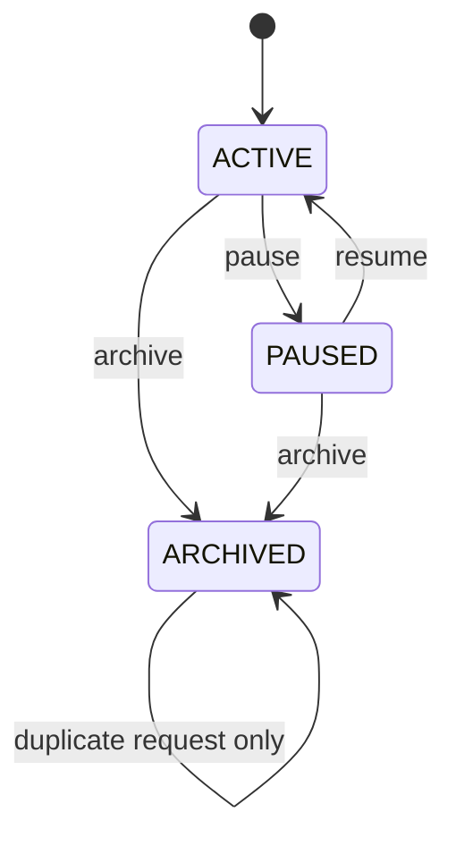

# Loot Crypto WatchItem 与 MonitoringSubscription V0.1

| 属性 | 值 |
|---|---|
| 状态 | Accepted for REQ-0014 |
| 版本 | 0.1 |
| 市场范围 | Crypto First |
| 事实源 | PostgreSQL `loot_test` / schema `loot` |

## 1. 目标与边界

本组件把用户明确选择的 Crypto 标的转为持久化监控身份，并为每个 timeframe 派生不可由
Agent 修改的 MonitoringSubscription：

```text
CreateWatchItemCommand
    -> Instrument
    -> WatchItem
    -> MonitoringSubscription[]
    -> Outbox
    -> Crypto Run-Once / Future Worker
```

V0.1 只支持 Crypto，并以 BTC-USDT H1 作为首个验收场景。不实现用户体系、TradingPlan、
Position、常驻调度、Alert、Replay 或自动交易。

## 2. 领域身份

### Instrument

- `instrument_id` 是跨链路稳定引用。
- 自然身份为 `(market, venue, symbol, instrument_type)`。
- 同一 `instrument_id` 或自然身份不能对应不同 payload。
- REQ-0014 只接受 `market=CRYPTO` 且 `status=ACTIVE` 的 Instrument。

### WatchItem

- 创建方必须提供 `request_id` 和 `watch_item_id`，禁止 Repository 临时生成业务身份。
- ACTIVE 唯一范围为 `(user_id, instrument_id, monitoring_profile)`。
- `market`、`venue`、`instrument_id` 和 `user_id` 创建后不可修改。
- 初始 `version=0`；每次有效生命周期变化加一。

### MonitoringSubscription

- 每个 WatchItem/timeframe 恰好一个 Subscription。
- ID 使用 `uuid5(watch_item_id + timeframe)` 稳定生成。
- Crypto `route_key` 固定为 `crypto:{instrument_id}:{timeframe}`，市场路由不交给模型。
- 初始 `config_version=1`；WatchItem 状态变化时同步状态并加一。

## 3. 生命周期



Subscription 状态映射：

| WatchItem | Subscription |
|---|---|
| ACTIVE | ACTIVE |
| PAUSED | PAUSED |
| ARCHIVED | ARCHIVED |

`ARCHIVED` 是终态；不能恢复。重复 `request_id` 且 payload 一致返回首次结果，不重复提升版本。

## 4. 命令与并发

创建命令包含：

- `request_id`、`watch_item_id`、`user_id`
- 完整 Instrument 契约
- `timeframes`、`monitoring_profile`、`enabled_signal_types`、`custom_zones`、`priority`
- UTC `occurred_at`

生命周期命令包含 `request_id`、`watch_item_id`、`expected_version`、目标状态和 UTC 时间。

事务规则：

1. 以 Inbox `(consumer_name, request_id)` 校验重投 payload 指纹。
2. 创建时对 ACTIVE 自然身份获取 transaction advisory lock。
3. 生命周期变更使用 `SELECT ... FOR UPDATE` 锁定 WatchItem。
4. `expected_version` 不匹配时拒绝，不自动覆盖用户更新。
5. WatchItem、Subscription 和 Outbox 在同一事务提交；任一步失败全部回滚。

## 5. 数据表

### `instruments`

保存稳定标的身份、状态和完整 canonical payload。

### `watch_items`

保存当前 WatchItem 投影。使用 partial unique index 保证同一用户、Instrument、profile 最多一个
ACTIVE WatchItem；PAUSED 恢复时仍由该约束和事务锁共同防冲突。

### `monitoring_subscriptions`

保存由 WatchItem 派生的 timeframe 调度入口。`(watch_item_id, timeframe)` 唯一；相同市场、
Instrument 和 timeframe 可以共享 route key，因为 route key 表达确定性路由目的地，不承担
Subscription 业务身份。

Inbox 和 Outbox 复用 REQ-0008 现有表，不新增第二套消息账本。

## 6. 事件

- `loot.watchlist.WatchItemCreated`
- `loot.watchlist.WatchItemPaused`
- `loot.watchlist.WatchItemResumed`
- `loot.watchlist.WatchItemArchived`
- `loot.monitoring.SubscriptionConfigured`
- `loot.monitoring.SubscriptionStatusChanged`

事件只表达已提交事实；消费者按至少一次投递处理。事件包含 WatchItem/Subscription ID、版本、
状态和 route key，不包含数据库凭据。

## 7. Run-Once 接入

Run-Once CLI 必须接收 `--watch-item-id`，并从 PostgreSQL 加载：

- ACTIVE WatchItem 及其 `version`。
- ACTIVE Instrument。
- 指定 H1 MonitoringSubscription 及其 `config_version` 和确定性 route key。

PAUSED、ARCHIVED、非 Crypto、非 H1 或缺失 Subscription 均在调用 Provider 前拒绝。应用服务仍
使用现有 `CryptoRunOnceCommand`，不改变 Policy Gate 或 Signal State Machine 权限边界。

## 8. 验收与迁移

- 增量 SQL 只新增表、索引和约束，不修改既有 10 张决策链表。
- `loot_migrator` 执行 DDL；`loot_app` 获得三张新表所需 DML 权限。
- 集成测试使用独立 UUID 并只清理自身数据，不 truncate 共享 schema。
- 真实验收完成前 REQ-0014 保持 In Progress，不能把仅内存测试表述为数据库已上线。
