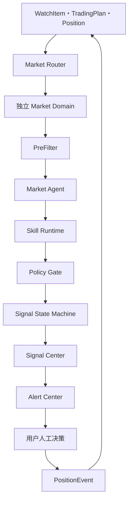
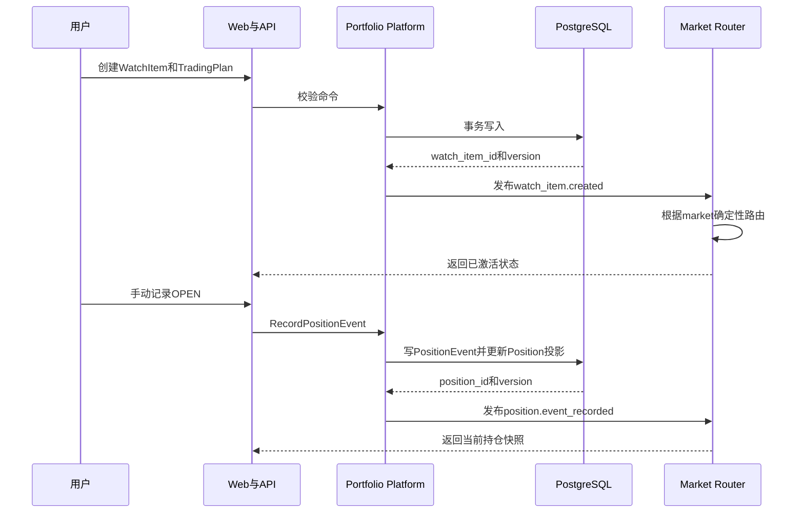
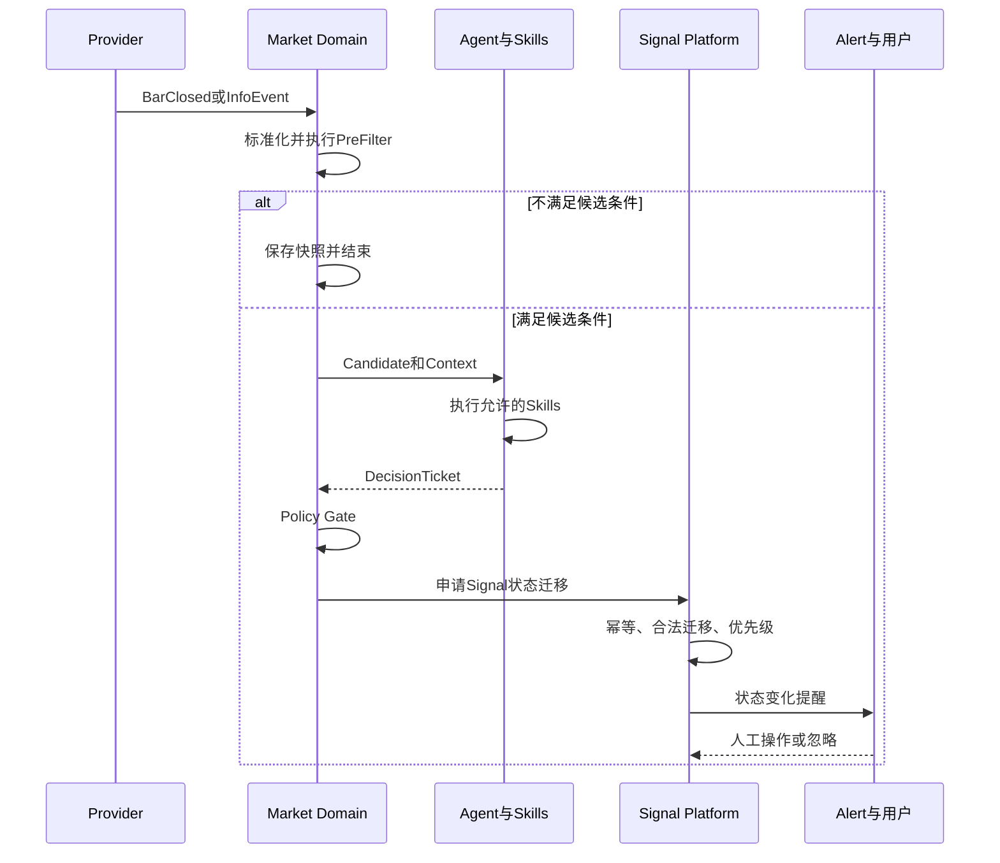
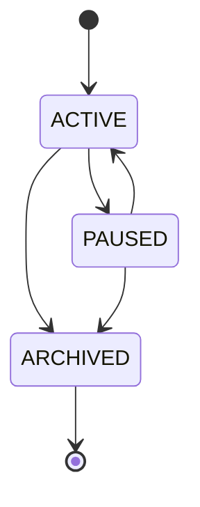
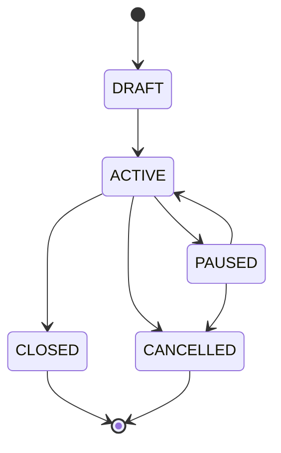
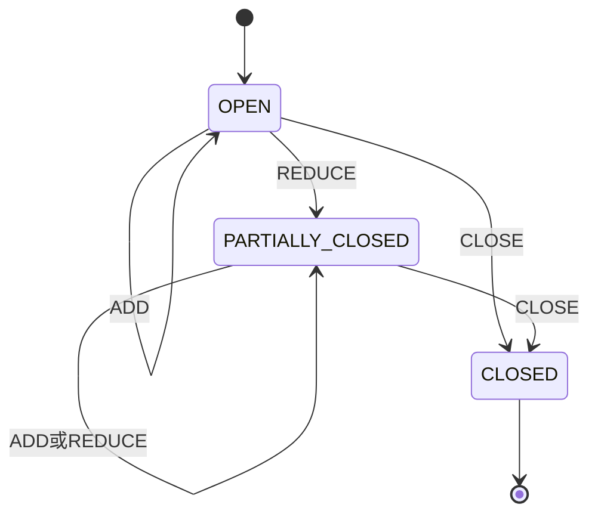
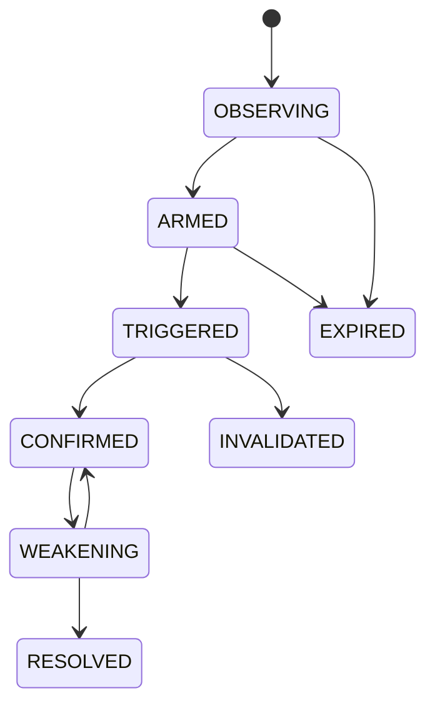

# Loot 自选与持仓信号监控闭环设计文档 V0.1

| 属性 | 值 |
|---|---|
| 状态 | Proposed |
| 版本 | 0.1 |
| 日期 | 2026-07-10 |
| 依赖 | Loot 宏观技术设计 |
| 涉及领域 | Platform、Crypto、US Equity、A-Share、Signal、Alert |

## 1. Problem Statement

用户需要在Crypto、美股和A股中持续关注自选及持仓，但不希望频繁打开交易软件检查K线、支撑阻力、成交量和信息变化。

本功能提供完整闭环：

```text
手动加入自选
→ 创建Trading Plan
→ 可选地记录开仓
→ 对应市场领域持续监控
→ 关键Signal状态变化
→ Dashboard和手机提醒
→ 用户人工决策
→ 追加PositionEvent
→ 更新后续监控上下文
```

## 2. Goals

- 用户可以手动创建、修改、暂停和归档WatchItem。
- 用户可以为WatchItem配置TradingPlan。
- 用户可以手动记录持仓和持仓变化。
- WatchItem按market确定性路由到独立Market Domain。
- 市场数据触发候选事件后，Agent通过受控Skills产生DecisionTicket。
- Signal状态机只在合法状态变化时发布SignalEvent。
- Alert Center按优先级、去重和冷却规则提醒。
- 所有人工动作、Skill执行和Signal变化可审计、可回放。

## 3. Non-Goals

- 不同步券商或交易所账户。
- 不自动推断用户是否成交。
- 不自动下单。
- 不做全市场扫描。
- 不在本Feature中定义所有市场Signal算法。
- 不允许用户上传任意执行代码。

## 4. User Scenarios

### Scenario A：只加入自选

用户添加BTC/USDT，选择Crypto、交易场所、主要周期和需要监控的Signal。系统开始监控接近关键区域、突破、回踩和结构失效，但不生成持仓盈亏提醒。

### Scenario B：创建交易计划

用户为某只A股配置方向、主要周期、失效位置和趋势退出方式。系统分析时必须带入TradingPlan。

### Scenario C：手动记录开仓

用户输入成交价格、数量、方向和当前止损。系统创建Position，并将提醒优先级从普通自选提升为持仓风险。

### Scenario D：收到Signal后人工处理

用户收到“趋势减弱”提醒，选择减仓或移动止损。系统追加PositionEvent，更新Position投影，之后所有Decision使用新状态。

## 5. Module Impact Matrix

| 模块 | 责任 | 主要变更 |
|---|---|---|
| apps/web | 用户交互 | 自选、计划、持仓、Signal Inbox、快捷操作 |
| apps/api | HTTP边界 | CRUD、PositionEvent、查询聚合 |
| platform/watchlist | 自选生命周期 | WatchItem命令、校验、事件 |
| platform/trading_plan | 交易计划 | 版本、启停、失效条件 |
| platform/portfolio | 持仓投影 | Position和PositionEvent |
| platform/router | 市场路由 | market到domain stream |
| scheduler | 监控计划 | 根据市场Session和周期调度 |
| domains/*/prefilter | 候选生成 | 市场专属低成本筛选 |
| domains/*/agent | 分析编排 | Market Agent上下文和Skill Plan |
| skill_runtime | 执行能力 | allowlist、schema、timeout、审计 |
| domains/*/policies | 准入 | 数据质量、市场规则、持仓约束 |
| domains/*/signals | 状态迁移 | SignalInstance状态机 |
| signal_center | 统一读模型 | Signal列表、优先级、关联持仓 |
| alert_center | 提醒 | 去重、冷却、投递、重试 |
| persistence | 数据事实源 | 表、索引、迁移和幂等记录 |
| observability | 可追踪性 | correlation、metrics、audit |

## 6. End-to-End Architecture



## 7. Manual Setup Sequence



## 8. Monitoring Sequence



## 9. Domain Model

### 9.1 WatchItem

```text
WatchItem
- id: UUID
- user_id: UUID
- instrument_id: UUID
- market: Market
- venue: string
- status: ACTIVE | PAUSED | ARCHIVED
- timeframes: Timeframe[]
- monitoring_profile: string
- enabled_signal_types: SignalType[]
- custom_zones: PriceZone[]
- priority: LOW | NORMAL | HIGH
- created_at: UTC datetime
- updated_at: UTC datetime
- version: integer
```

约束：

- 同一用户、instrument和monitoring_profile只能存在一个ACTIVE WatchItem。
- market创建后不可直接修改；需要归档后重新创建。
- ARCHIVED不可恢复，PAUSED可以恢复。

### 9.2 TradingPlan

```text
TradingPlan
- id: UUID
- watch_item_id: UUID
- direction: LONG | SHORT | NEUTRAL
- primary_timeframe: Timeframe
- thesis: text
- entry_conditions: VersionedCondition
- invalidation: VersionedCondition
- max_risk_r: Decimal | null
- exit_mode: FIXED_TARGET | STRUCTURE_TRAILING | MANUAL
- enabled_skill_ids: string[]
- status: DRAFT | ACTIVE | PAUSED | CLOSED | CANCELLED
- config_version: integer
- created_at: UTC datetime
- updated_at: UTC datetime
- version: integer
```

规则：

- 一个WatchItem同一时间最多一个ACTIVE TradingPlan。
- ACTIVE计划的关键字段修改必须增加config_version。
- 计划关闭不自动关闭Position，API必须要求用户明确处理。

### 9.3 Position

```text
Position
- id: UUID
- trading_plan_id: UUID
- instrument_id: UUID
- market: Market
- instrument_type: InstrumentType
- side: LONG | SHORT
- quantity: Decimal
- average_entry_price: Decimal
- current_stop: Decimal | null
- realized_pnl: Decimal
- status: OPEN | PARTIALLY_CLOSED | CLOSED
- opened_at: UTC datetime
- closed_at: UTC datetime | null
- version: integer
```

Position是由PositionEvent计算出的当前投影，不是操作历史。

### 9.4 PositionEvent

```text
PositionEvent
- id: UUID
- position_id: UUID
- event_type: OPEN | ADD | REDUCE | MOVE_STOP | CLOSE
- quantity_delta: Decimal | null
- execution_price: Decimal | null
- previous_stop: Decimal | null
- new_stop: Decimal | null
- occurred_at: UTC datetime
- note: text | null
- idempotency_key: string
- created_at: UTC datetime
```

规则：

- PositionEvent写入后不可更新或删除。
- 修正错误通过追加CORRECTION事件实现；该类型可在实现阶段加入。
- OPEN必须创建Position。
- CLOSE后禁止ADD、REDUCE和MOVE_STOP。
- REDUCE不能使quantity小于0。
- 每次事件必须在同一事务中更新Position投影。

### 9.5 MonitoringSubscription

由WatchItem派生，不直接由用户编辑：

```text
MonitoringSubscription
- id: UUID
- watch_item_id: UUID
- market: Market
- instrument_id: UUID
- timeframe: Timeframe
- route_key: string
- next_run_at: UTC datetime | null
- status: ACTIVE | PAUSED | ERROR
- config_version: integer
```

Crypto可以持续订阅；美股和A股由Session-aware Scheduler控制。

### 9.6 SignalInstance

```text
SignalInstance
- id: UUID
- watch_item_id: UUID
- position_id: UUID | null
- market: Market
- instrument_id: UUID
- timeframe: Timeframe
- signal_type: SignalType
- state: OBSERVING | ARMED | TRIGGERED | CONFIRMED |
         WEAKENING | INVALIDATED | RESOLVED | EXPIRED
- priority: Priority
- actionability: Actionability
- latest_decision_ticket_id: UUID
- dedupe_key: string
- last_transition_at: UTC datetime
- expires_at: UTC datetime | null
- version: integer
```

唯一键建议：

```text
(watch_item_id, position_id nullable, timeframe, signal_type, dedupe_key)
```

## 10. State Machines

### 10.1 WatchItem



### 10.2 TradingPlan



### 10.3 Position



### 10.4 Signal



每个Market Domain提供自己的TransitionPolicy。共享状态机引擎只执行转换，不定义市场条件。

## 11. API Design

API前缀建议为 `/api/v1`。

### 11.1 WatchItem

| Method | Path | 说明 |
|---|---|---|
| POST | /watch-items | 创建自选 |
| GET | /watch-items | 查询自选 |
| GET | /watch-items/{id} | 查询详情 |
| PATCH | /watch-items/{id} | 修改周期、Profile、优先级 |
| POST | /watch-items/{id}/pause | 暂停 |
| POST | /watch-items/{id}/resume | 恢复 |
| POST | /watch-items/{id}/archive | 归档 |

### 11.2 TradingPlan

| Method | Path | 说明 |
|---|---|---|
| POST | /watch-items/{id}/trading-plans | 创建DRAFT |
| PATCH | /trading-plans/{id} | 修改计划 |
| POST | /trading-plans/{id}/activate | 激活 |
| POST | /trading-plans/{id}/pause | 暂停 |
| POST | /trading-plans/{id}/close | 关闭 |
| POST | /trading-plans/{id}/cancel | 取消 |

### 11.3 Position

| Method | Path | 说明 |
|---|---|---|
| POST | /trading-plans/{id}/positions | 记录OPEN |
| GET | /positions | 查询当前持仓 |
| GET | /positions/{id} | 查询详情与事件 |
| POST | /positions/{id}/events | ADD、REDUCE、MOVE_STOP、CLOSE |

写PositionEvent必须携带：

- Idempotency-Key Header
- expected_position_version
- occurred_at

### 11.4 Signal and Alert

| Method | Path | 说明 |
|---|---|---|
| GET | /signals | 按市场、持仓、状态和优先级查询 |
| GET | /signals/{id} | 查看Evidence和Decision |
| POST | /signals/{id}/ignore | 忽略当前提醒 |
| GET | /alerts | 查询投递历史 |
| POST | /alerts/{id}/acknowledge | 已读 |

## 12. Command and Event Contracts

### 12.1 Commands

- CreateWatchItem
- UpdateWatchItem
- PauseWatchItem
- CreateTradingPlan
- ActivateTradingPlan
- RecordPositionEvent
- EvaluateCandidate
- ApplySignalTransition
- RequestAlert

Command必须包含command_id、actor、expected_version和requested_at。

### 12.2 Domain Events

```text
watch_item.created.v1
watch_item.updated.v1
watch_item.status_changed.v1
trading_plan.activated.v1
trading_plan.updated.v1
position.event_recorded.v1
position.projection_updated.v1
monitoring.subscription_changed.v1
market.candidate_detected.v1
decision.ticket_created.v1
signal.state_changed.v1
alert.requested.v1
alert.delivered.v1
alert.failed.v1
```

### 12.3 Event Envelope

```json
{
  "event_id": "uuid",
  "event_type": "position.event_recorded",
  "event_version": 1,
  "occurred_at": "UTC timestamp",
  "producer": "platform.portfolio",
  "correlation_id": "uuid",
  "causation_id": "uuid",
  "partition_key": "position_id",
  "payload": {}
}
```

## 13. Market Routing

路由规则固定：

```text
CRYPTO    → market.crypto.events
US_EQUITY → market.us_equity.events
A_SHARE   → market.a_share.events
```

Router只读取WatchItem.market，不调用模型，不进行模糊判断。

无法识别market时：

- 拒绝创建WatchItem，或
- 将MonitoringSubscription置为ERROR。

绝不使用默认市场兜底。

## 14. PreFilter Design

PreFilter是市场领域内的确定性模块，用于降低Agent调用量。

输入：

- 最新MarketSnapshot
- WatchItem配置
- TradingPlan
- 当前Position
- 活跃SignalInstance
- 最近信息事件

输出：

```text
NO_CANDIDATE
或
CandidateEvent
- candidate_type
- trigger_reason
- snapshot_id
- watch_item_id
- position_id
- suggested_skill_group
- urgency
- expires_at
```

典型候选：

- 接近用户关键区域
- 新K线突破当前结构区
- 成交量异常
- 趋势结构改变
- 当前价格接近持仓失效位置
- 新信息事件映射到该标的

## 15. Agent Context

Context Builder只提供任务所需信息：

- Market、Instrument和Session
- WatchItem
- TradingPlan
- Position
- 当前及相邻周期MarketSnapshot
- 活跃Signal状态
- CandidateEvent
- 已结构化的信息事件
- 可调用Skill列表
- 执行预算和截止时间

禁止直接向Agent塞入无限历史K线或未筛选新闻正文。

## 16. Skill Execution

### 16.1 Required Skill Groups

第一版至少提供：

- market_structure_assessment
- volume_confirmation
- position_risk_assessment
- actionability_assessment
- signal_decision

具体实现按市场分开，例如：

```text
crypto.market_structure_assessment
us_equity.market_structure_assessment
a_share.market_structure_assessment
```

### 16.2 Mandatory Guards

任何Signal状态迁移前必须通过：

- DataQualityGuard
- MarketRuleGuard
- SkillVersionGuard
- PositionConsistencyGuard
- SignalTransitionGuard
- AlertCooldownGuard只影响提醒，不影响Signal事实

### 16.3 SkillRun Audit

每次执行记录：

- skill_run_id
- skill_id和version
- agent_run_id
- input_snapshot_id
- input_hash
- output
- status
- started_at和finished_at
- error_code
- model和prompt_version，若为AI_ASSISTED

## 17. Decision and Signal Application

DecisionSkill生成DecisionTicket，但不直接写Signal：

```text
suggested_transition
confidence
evidence_refs
actionability
position_impact
invalidation
next_check_at
explanation
```

Signal State Machine执行：

1. 按signal_id读取当前状态和version。
2. 检查DecisionTicket未被消费。
3. 运行市场TransitionPolicy。
4. 使用乐观锁写入新状态。
5. 追加SignalTransition记录。
6. 发布signal.state_changed。

重复消费同一DecisionTicket必须返回同一个结果。

## 18. Alert Policy

### 18.1 Priority

建议优先级：

```text
CRITICAL：持仓失效、清算或无法退出风险
HIGH：持仓趋势反转、确认突破
NORMAL：自选进入ARMED、回踩观察
LOW：日常状态摘要
```

### 18.2 Deduplication

dedupe_key建议由以下字段生成：

```text
user_id
signal_id
to_state
signal_transition_version
channel
```

### 18.3 Cooldown

- 状态变化不受冷却阻断，只影响是否再次推送。
- CRITICAL可以覆盖普通冷却。
- 用户人工更新Position后，可以重新计算提醒上下文。
- 通知失败不能回滚Signal。

## 19. Persistence Transactions

### 19.1 Create WatchItem

同一数据库事务：

1. 写WatchItem。
2. 写TradingPlan，可选。
3. 写MonitoringSubscription。
4. 写OutboxEvent。

### 19.2 Record PositionEvent

同一数据库事务：

1. 校验Idempotency-Key。
2. 锁定或乐观校验Position version。
3. 写PositionEvent。
4. 更新Position投影。
5. 写OutboxEvent。

### 19.3 Signal Transition

同一数据库事务：

1. 校验DecisionTicket。
2. 校验Signal version。
3. 追加SignalTransition。
4. 更新SignalInstance。
5. 标记DecisionTicket已应用。
6. 写OutboxEvent。

可以使用Outbox Relay将关键事件发布到Redis Streams，避免数据库提交成功但事件未发送。

## 20. Idempotency and Concurrency

| 场景 | 处理 |
|---|---|
| 用户重复点击OPEN | Idempotency-Key返回首次结果 |
| Position并发更新 | expected_version冲突返回409 |
| 同一Bar重复到达 | provider_event_id和time bucket去重 |
| Candidate重复投递 | candidate dedupe_key |
| DecisionTicket重复消费 | consumed_at和唯一约束 |
| Signal并发迁移 | version乐观锁和合法迁移校验 |
| Alert重复消费 | alert dedupe_key唯一索引 |

## 21. Failure Handling

| 故障 | 行为 |
|---|---|
| Provider断线 | Subscription标记DEGRADED，重连并补拉缺口 |
| K线缺失 | DataQualityGuard阻止高置信度迁移 |
| PreFilter失败 | 记录错误并等待下一周期，不唤醒Agent |
| Agent超时 | 终止本次run，允许确定性降级 |
| Skill超时 | SkillRun标记FAILED，DecisionSkill不得伪造Evidence |
| LLM不可用 | 保留技术分析；信息解释降级 |
| Policy拒绝 | 保存拒绝原因，必要时安排next_check_at |
| Redis暂时不可用 | Outbox保留，恢复后重放 |
| Alert渠道失败 | 独立重试，Signal状态不回滚 |
| 用户版本冲突 | 返回当前投影，要求用户确认后重试 |

## 22. Observability

### 22.1 Logs

所有结构化日志至少包含：

- correlation_id
- user_id
- market
- instrument_id
- watch_item_id
- position_id
- signal_id
- skill_run_id
- decision_ticket_id

### 22.2 Metrics

- active_watch_items
- active_positions
- monitoring_lag_seconds
- candidate_events_total
- agent_runs_total
- skill_runs_total和skill_failures_total
- policy_rejections_total
- signal_transitions_total
- alerts_requested_total
- alerts_delivery_latency_seconds
- duplicate_events_suppressed_total

### 22.3 Audit Views

Signal详情页必须能展示：

```text
MarketSnapshot
→ CandidateEvent
→ Agent Run
→ SkillRuns
→ Evidence
→ DecisionTicket
→ Policy结果
→ SignalTransition
→ AlertDelivery
→ User PositionEvent
```

## 23. Security and Permissions

- V1即使只有单用户，也保留user_id隔离。
- API修改操作需要身份验证。
- Provider密钥只能由Provider模块读取。
- Skill通过Capability声明访问数据，不能读取任意数据库表。
- Agent只接收脱敏且经过Context Builder裁剪的数据。
- 日志不得输出Provider密钥、模型密钥和完整敏感配置。
- 不提供任何TRADE_EXECUTION capability。

## 24. Testing Strategy

### 24.1 Unit Tests

- WatchItem状态迁移
- TradingPlan版本
- PositionEvent投影
- Market Router
- PreFilter条件
- Skill输入输出校验
- Policy Guard
- Signal合法和非法迁移
- Alert dedupe和cooldown

### 24.2 Contract Tests

- API schema
- Event Envelope
- Skill Manifest
- DecisionTicket
- SignalEvent
- Provider adapter

### 24.3 Integration Tests

- 创建WatchItem后生成正确MonitoringSubscription。
- OPEN事件创建Position并进入对应市场上下文。
- Candidate到Signal再到Alert完整闭环。
- Redis重复消息不产生重复Signal。
- Alert失败不回滚Signal。

### 24.4 Replay and Golden Cases

至少准备以下Golden Case：

1. 自选接近阻力，进入ARMED。
2. 放量突破，进入TRIGGERED。
3. 收盘确认，进入CONFIRMED。
4. 突破失败，进入INVALIDATED。
5. 持仓高点降低并结构破坏，进入WEAKENING再RESOLVED。
6. 同一事件重复三次，只产生一次状态迁移和提醒。

三个市场必须分别维护Golden Case，不能只复用输入数据。

## 25. Acceptance Criteria

- 用户能手动创建三个市场的WatchItem。
- 用户能创建并激活TradingPlan。
- 用户能通过PositionEvent维护完整持仓历史。
- WatchItem只能进入对应Market Domain。
- 没有Candidate时不会触发Agent。
- Agent只能调用市场allowlist内Skill。
- Signal状态只通过Policy和状态机改变。
- 同一DecisionTicket不会重复迁移。
- Signal状态变化后能产生一次有效提醒。
- 用户操作后，下一次分析使用最新Position投影。
- 核心链路可通过correlation_id完整追踪。
- 关键路径具备单元、集成和Replay测试。

## 26. Codex Implementation Plan

Codex应按以下顺序实施，不允许直接从UI或Agent开始：

### Step 1：Contracts

- Market、InstrumentType、Timeframe、SignalState枚举
- EventEnvelope
- WatchItem、TradingPlan、PositionEvent
- CandidateEvent、EvidenceSet、DecisionTicket、SignalEvent

### Step 2：Persistence

- PostgreSQL schema
- migrations
- repository interfaces
- idempotency表
- outbox表

### Step 3：Platform Domain

- WatchItem lifecycle
- TradingPlan lifecycle
- PositionEvent和Position投影
- Market Router

### Step 4：Signal Foundation

- SignalInstance
- transition engine
- domain-owned transition policy interface
- dedupe和optimistic locking

### Step 5：Market Vertical Stub

- 每个市场建立独立domain package
- 使用FakeProvider和FakePreFilter
- 验证三条route不串线

### Step 6：Skill Runtime

- SkillManifest
- registry
- executor
- schema validation
- timeout和audit
- allowlist

### Step 7：Agent and Policy

- Context Builder
- Market Agent接口
- Decision Skill
- mandatory guards
- DecisionTicket application

### Step 8：Alert Loop

- Signal Center读模型
- Alert Policy
- Notifier接口
- FakeNotifier
- 用户ack和ignore

### Step 9：API and UI

- CRUD和PositionEvent API
- Dashboard
- K线Signal标注
- 快捷人工操作

### Step 10：Real Provider and Replay

- 选择首个市场Provider
- 历史数据导入
- Golden Cases
- 端到端Replay

## 27. Rollout and Rollback

### Rollout

1. FakeProvider本地闭环。
2. 单一测试标的Shadow模式，只记录不提醒。
3. 开启Dashboard提醒。
4. 开启单一手机渠道。
5. 扩展到更多自选标的。
6. 分别启用另外两个Market Domain。

### Rollback

- 通过Feature Flag关闭某市场Agent或某Skill版本。
- 保留数据采集和确定性PreFilter。
- Signal状态不删除，通过新的Transition或人工标记修正。
- Skill回滚时保留旧版本以支持历史Replay。
- 通知渠道可单独关闭，不影响Signal事实。

## 28. Open Questions

- 三个市场分别使用哪些主要Timeframe？
- 第一条真实Market Domain选择Crypto、美股还是A股？
- 第一批启用哪些SignalType？
- 用户自定义PriceZone是否参与强制决策或只作为Evidence？
- Position修正是否在V1引入CORRECTION事件？
- 首个手机Notifier使用哪个渠道？
