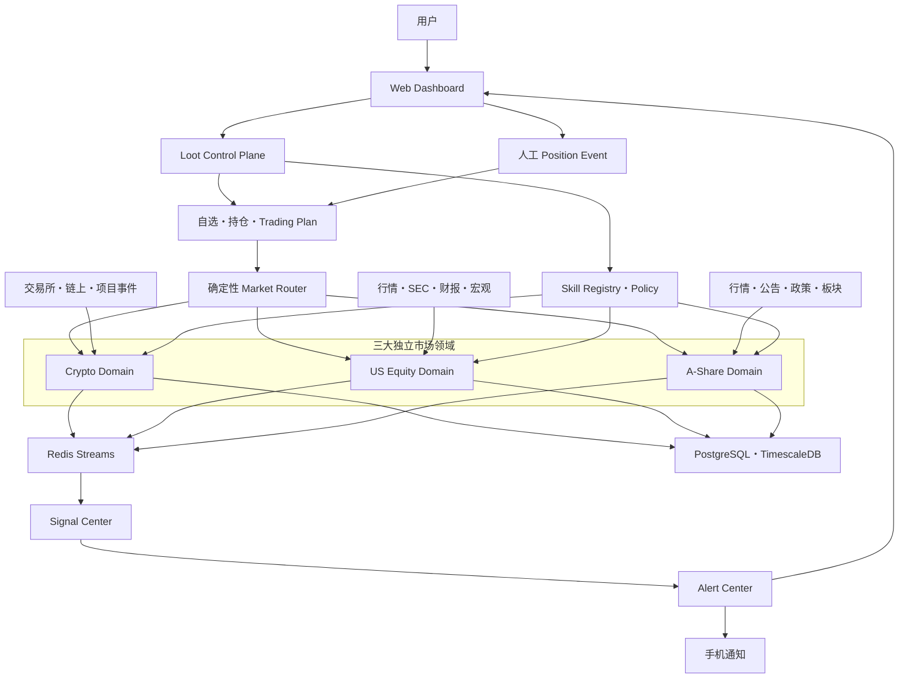
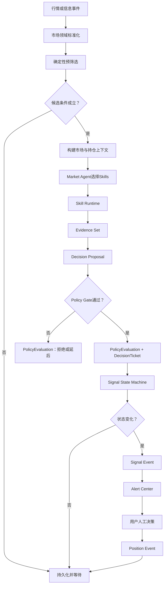

# Loot 系统宏观架构设计文档 V0.1

| 属性 | 值 |
|---|---|
| 状态 | Proposed |
| 版本 | 0.1 |
| 日期 | 2026-07-10 |
| 最后设计回归 | 2026-07-15 |
| 适用范围 | V1：个人自选与手动持仓监控 |
| 目标读者 | Codex、开发者、架构评审者 |

## 1. Executive Summary

Loot 是一个覆盖 Crypto、US Equity 和 A-Share 的个人市场信号监控系统。它持续处理行情、量价结构和信息事件，在关键状态变化时提醒用户，从而减少频繁看盘。

V1 的核心架构为：

> 模块化单体 + 多进程事件驱动 + 三个独立市场领域 + Agent/Skill 受控决策 + 统一信号与提醒平台。

三个市场共享控制面、基础设施、契约和纯量化函数，但各自拥有完整的数据语义、信息链路、Agent、Skills、Policy、风险判断和 Signal State Machine。

交付顺序采用 `Crypto First Vertical Slice`。三市场是最终架构边界，不是当前并行实施
范围；先用 Crypto 搭建并验证完整初版链路，再从真实实现中提炼共享平台能力，最后分别
扩展 US Equity 和 A-Share。

## 2. Goals and Non-Goals

### 2.1 Goals

- 手动维护自选、持仓和 Trading Plan。
- 持续监控用户关注标的，不要求用户持续打开交易软件。
- 支持支撑阻力、量价、趋势、波动率和信息事件分析。
- 通过独立市场领域处理三类市场不同的交易模式。
- 将 Agent 的能力限制在可审计、可版本化的 Skills 内。
- 只在 Signal 状态发生有意义变化时提醒。
- 保留输入快照、Skill版本、决策证据和人工操作，支持复盘与回放。

### 2.2 Non-Goals

V1 明确不做：

- 自动下单、撤单和交易账户连接。
- 券商或交易所账户持仓同步。
- 全市场机会扫描。
- Tick级高频交易。
- 依赖大模型计算K线指标。
- 由大模型直接决定或写入买卖信号。
- 为三大市场设计一套通用业务规则。

## 3. Architecture Principles

1. **Vertical Market Ownership**：市场差异贯穿采集、标准化、分析、决策、状态机和可操作性。
2. **Deterministic Before Agentic**：普通代码先预筛选，只有候选事件才唤醒 Agent。
3. **Agent Plans, Skills Execute**：Agent 编排，Skill 执行，Policy 准入，状态机生效。
4. **Typed Contracts**：跨模块交互必须使用版本化强类型契约。
5. **Append-Only User Actions**：持仓变化以 PositionEvent 追加记录。
6. **State Transition Alerts**：提醒状态变化，不提醒每次重复命中。
7. **At-Least-Once and Idempotent**：事件允许重复投递，业务处理必须幂等。
8. **Replayability**：每个决策必须能还原数据、规则和Skill版本。
9. **Build a Modular Monolith First**：代码一体、进程隔离，不提前拆微服务。
10. **Content-Addressed Inputs**：MarketSnapshot identity 必须绑定完整输入窗口内容，
    不能只绑定最新一条数据。
11. **Persisted Authorization Proof**：状态机必须从事实源验证 Policy 授权链和上下文
    版本，不能信任调用方构造的 Ticket。

## 4. System Context



## 5. Logical Planes

### 5.1 Experience Plane

负责用户交互：

- 自选管理
- Trading Plan 编辑
- 手动开仓、加仓、减仓、移动止损和平仓
- K线、支撑阻力区域和Signal标注
- 当前持仓风险
- Signal Inbox
- 提醒设置
- 决策历史和复盘

### 5.2 Control Plane

Control Plane 不做市场判断，负责：

- WatchItem、TradingPlan、Position 生命周期
- 确定性 Market Router
- 调度计划
- Skill Registry、版本和权限
- Agent运行预算、超时和模型配置
- Feature Flag
- 通知偏好
- 审计与运行状态

### 5.3 Market Data and Decision Plane

三个市场是独立 bounded context。每条链路内部完整包含：

```text
Provider
→ Normalization
→ Market Snapshot
→ Deterministic PreFilter
→ Context Builder
→ Deterministic Analyzer / Market Agent
→ Skill Runtime / Versioned Rules
→ Decision Builder / Decision Skill
→ Decision Proposal
→ Policy Gate
→ Decision Ticket
→ Signal State Machine
→ Signal Event
```

### 5.4 Signal and Alert Plane

统一处理三个市场已经确认的 Signal Event：

- Signal持久化和查询
- 用户与持仓关联
- 优先级
- 去重键
- 冷却时间
- 提醒渠道
- 投递重试
- 已读、忽略和用户反馈

该层不能重新解释市场业务，也不能推翻 Market Domain 经 Policy Gate 授权的
DecisionTicket。

### 5.5 Data Platform

- PostgreSQL：业务状态事实源。
- TimescaleDB：K线和时间序列。
- Redis：热状态、分布式锁、限流和Streams。
- Parquet：历史归档和离线回放数据。
- Object Storage：原始公告、新闻正文和大体积快照，V1可延后。

## 6. Market Bounded Contexts

### 6.1 Crypto Domain

负责：

- 7×24交易Session
- 多交易所和交易对映射
- 现货与永续合约
- LONG、SHORT、NEUTRAL 市场方向判断，以及方向与实际持仓、可操作性的隔离
- K线、成交量、资金费率、OI和爆仓
- 杠杆及清算风险
- 项目事件和链上事件
- Crypto专属Signal和Actionability

### 6.2 US Equity Domain

负责：

- 盘前、正常交易和盘后Session
- 股票与ETF
- 拆股、分红和复权
- 财报窗口、SEC文件和公司披露
- 跳空与分Session成交量基准
- 宏观数据发布窗口
- 美股专属Signal和Actionability

### 6.3 A-Share Domain

负责：

- 集合竞价、正常交易和午间休市
- 股票与ETF
- 复权、停复牌和证券级交易规则
- T+1及可卖数量语义
- 公告、政策、板块和产业链信息
- 涨跌停、成交约束和板块扩散
- A股专属Signal和Actionability

交易约束必须落实到 InstrumentPolicy，不能假设同一市场所有证券规则完全相同。

## 7. Agent and Skill Governance

### 7.1 Agent Responsibilities

每个市场拥有独立 Market Agent。Agent 可以：

- 读取 Context Builder 提供的有限上下文。
- 选择允许的Skills。
- 决定Skill调用顺序。
- 汇总Evidence。
- 申请Decision Skill。
- 生成人类可读解释。

Agent 不可以：

- 直接读取任意外部网络资源。
- 直接写Position和Signal。
- 跳过Policy Gate。
- 调用其他市场的专属Skill。
- 发送交易指令。
- 在无Evidence时生成有效Signal。

### 7.2 Skill Categories

| 类型 | 作用 | 示例 |
|---|---|---|
| Analysis Skill | 生成结构化Evidence | breakout_assessment |
| Information Skill | 提取、归因和映射信息事件 | announcement_impact |
| Decision Skill | 将Evidence组合为DecisionProposal | position_exit_decision |
| Guard Skill | 强制数据、市场和风险约束 | actionability_guard |

Agent可调用Skill保持中等粒度。ATR、Pivot和统计函数放在Skill内部，不全部暴露为Agent工具。

### 7.3 Skill Manifest

每个Skill至少声明：

```yaml
id: a_share.volume_breakout_assessment
version: 1.0.0
markets: [A_SHARE]
instruments: [STOCK, ETF]
triggers: [ON_BAR_CLOSE]
input_schema: VolumeBreakoutInputV1
output_schema: EvidenceSetV1
runtime: DETERMINISTIC
side_effect: READ_ONLY
timeout_ms: 1000
```

### 7.4 Decision Authority

```text
Market Agent
→ SkillRun
→ EvidenceSet
→ DecisionProposal
→ Policy Gate
→ PolicyEvaluation
→ DecisionTicket
→ Signal State Machine
```

DecisionProposal 只是建议；Policy Gate 无论批准、拒绝还是延后都要记录
PolicyEvaluation，只有批准时才签发 DecisionTicket。只有最后一步能改变
SignalInstance 状态。

PolicyEvaluation 是不可变评估事实。相同评估请求幂等返回；DEFERRED 到期或上下文
变化后追加新评估。一个 Proposal 整个生命周期最多签发一张 DecisionTicket。

## 8. Core Contracts

### 8.1 Instrument

统一身份字段：

- instrument_id
- market
- venue
- symbol
- instrument_type
- quote_currency
- timezone
- price_scale
- status

市场专属属性进入对应领域的InstrumentProfile。

### 8.2 WatchItem

- 用户关注标的
- 监控周期
- 监控Profile
- 用户自定义关键区域
- 优先级
- 启用状态

### 8.3 TradingPlan

- direction
- primary_timeframe
- thesis
- entry_conditions
- invalidation
- max_risk_r
- exit_mode
- enabled_signal_types
- status
- version

### 8.4 Position and PositionEvent

Position 是当前投影，PositionEvent 是历史事实。

```text
OPEN
ADD
REDUCE
MOVE_STOP
CLOSE
```

TradingPlan 取消属于 TradingPlan 生命周期事件，不进入 PositionEvent。

### 8.5 CandidateEvent

由确定性预筛选产生，表示值得进一步分析，不表示Signal成立。

### 8.6 EvidenceSet

包含Skill输出的结构化证据、质量、观测时间、过期时间和输入快照引用。

### 8.7 DecisionProposal

至少包含：

- market、instrument和timeframe
- suggested_transition
- evidence_refs
- skill_versions
- rule_version
- actionability
- position_impact
- invalidation
- next_check_at
- input_snapshot_id
- decision_summary

DecisionProposal 可以由 Decision Skill 或确定性 Decision Builder 产生，但不能直接
进入状态机。

### 8.8 PolicyEvaluation 和 DecisionTicket

PolicyEvaluation 记录 Proposal 的批准、拒绝或延后结果及 Guard 明细。只有批准结果
才能签发 DecisionTicket。

DecisionTicket 至少包含：

- proposal_id 和 policy_evaluation_id
- policy_version 和 proposal_digest
- market、instrument、timeframe 和 signal_id
- authorized_transition
- actionability 和 position_impact
- input_snapshot_id
- expected_signal_version、业务上下文版本和 context_digest
- issued_at 和 expires_at
- dedupe_key

DecisionTicket 是 Policy Gate 之后的不可变授权凭证，只能由 Policy Gate 创建。状态机
必须通过事实仓库端口核验 APPROVED PolicyEvaluation、proposal_digest 和上下文版本；
生产适配器使用 PostgreSQL。

### 8.9 SignalEvent

跨领域统一输出：

```json
{
  "event_id": "uuid",
  "signal_id": "uuid",
  "market": "A_SHARE",
  "instrument_id": "uuid",
  "signal_type": "VOLUME_BREAKOUT",
  "from_state": "ARMED",
  "to_state": "TRIGGERED",
  "priority": "HIGH",
  "actionable_now": false,
  "position_impact": "PROFIT_PROTECTION",
  "decision_ticket_id": "uuid",
  "occurred_at": "UTC timestamp",
  "dedupe_key": "stable key"
}
```

## 9. Event Model

建议的核心Stream：

```text
market.crypto.events
market.us_equity.events
market.a_share.events
signal.events
alert.events
```

关键事件：

- watch_item.created
- watch_item.updated
- trading_plan.activated
- position.event_recorded
- market.bar_closed
- market.info_event_detected
- market.candidate_detected
- skill.run_completed
- decision.proposal_created
- decision.policy_evaluated
- decision.ticket_issued
- signal.state_changed
- alert.requested
- alert.delivered
- alert.failed

事件必须包含 event_id、event_version、occurred_at、correlation_id、causation_id 和 producer。

## 10. Runtime Flow



## 11. Persistence Design

建议使用单个PostgreSQL实例和按边界划分的Schema：

```text
platform
contracts
crypto
us_equity
a_share
signals
alerts
observability
```

原则：

- 金额、成本和持仓数量使用Decimal/NUMERIC语义。
- 大规模K线分析字段可使用DOUBLE PRECISION或缩放整数。
- JSONB只承载有版本的扩展Payload，不替代核心关系字段。
- Signal、DecisionProposal、PolicyEvaluation、DecisionTicket、SkillRun 和
  PositionEvent 保留不可变历史。
- Position等投影使用乐观锁version字段。
- 所有软删除记录保留审计信息。

TimescaleDB可用于基础K线hypertable和多周期聚合，但带Session、复权和市场规则的权威K线由对应Market Domain生成。

## 12. Process Topology

V1使用同一代码仓库和镜像，按命令启动不同进程：

```text
loot-api
loot-scheduler
loot-worker-crypto
loot-worker-us-equity
loot-worker-a-share
loot-agent-worker
loot-notifier
loot-web
postgres-timescale
redis
```

该方式提供领域故障隔离，同时避免微服务RPC、服务发现和分布式事务。

## 13. Technology Direction

| 位置 | 建议 |
|---|---|
| Backend | Python、FastAPI、Pydantic |
| Persistence | PostgreSQL、TimescaleDB、SQLAlchemy、版本化 SQL migration |
| Event Transport | Redis Streams |
| Quantitative | NumPy、Polars |
| Agent Runtime | 自研轻量Typed Skill Runtime和LLM Provider接口 |
| Frontend | Next.js、TypeScript |
| Chart | TradingView Lightweight Charts |
| Deployment | Docker Compose |
| Testing | pytest、contract test、replay、golden case |
| Observability | structured logging、metrics、trace correlation |

### 13.1 Why a Custom Thin Agent Runtime

V1的核心是可控Skill、Policy和状态机，而不是复杂长流程Agent。自研轻量Runtime只负责：

- Skill注册与发现
- 输入输出校验
- allowlist
- timeout、retry和budget
- SkillRun审计
- LLM Provider抽象

不在V1引入复杂多Agent框架或分布式工作流引擎。

### 13.2 Why Redis Streams

市场和信号处理需要有序事件、Consumer Group和可恢复消费，不使用易丢失离线消息的Pub/Sub作为核心总线。

### 13.3 Why Modular Monolith

- 当前是单人或小团队绿地项目。
- 三大领域需要代码边界，不需要网络边界。
- 可以独立运行三个Market Worker。
- 某个领域未来有独立扩缩容压力时再拆服务。

## 14. Reliability and Failure Handling

- Provider断线：重连、补拉缺口、数据质量标记。
- 乱序或重复行情：按provider_event_id和时间桶幂等。
- Snapshot identity 冲突：完整窗口内容不同必须形成不同 content hash 和 snapshot_id。
- 提前闭合 K 线：`is_closed=True` 但 received_at 早于 closed_at 时拒绝。
- Skill超时：记录FAILED，降级为确定性结果或安排复查。
- LLM失败：不能阻断基础技术信号；标记解释或信息增强缺失。
- Redis重复消息：消费者使用event_id和业务dedupe_key。
- Policy 拒绝或延后：保留 DecisionProposal、PolicyEvaluation 和原因，不签发
  DecisionTicket。
- Policy 延后重评：使用新的 evaluation context 追加评估，不覆盖首次结果。
- Ticket 过期：状态机拒绝迁移并记录审计结果。
- Ticket 授权链或上下文版本不一致：拒绝迁移并记录安全审计。
- 通知失败：独立重试，不回滚Signal状态。
- 数据缺失：Guard阻止高置信度Signal。

## 15. Observability

每个端到端执行链必须能通过以下标识关联：

- correlation_id
- causation_id
- input_snapshot_id
- snapshot_content_hash
- skill_run_id
- decision_proposal_id
- policy_evaluation_id
- decision_ticket_id
- signal_id
- alert_id

核心指标：

- Provider延迟和缺口数
- 每市场Candidate数量
- Agent唤醒次数和成本
- Skill成功率、延迟和超时
- Policy拒绝率
- Signal状态迁移数
- 重复Signal抑制数
- Alert投递成功率和延迟
- 用户忽略率

## 16. Replay and Evaluation

Replay Engine 使用历史MarketSnapshot、Skill版本和Policy版本重放：

- Candidate是否正确生成
- Evidence是否一致
- DecisionProposal是否稳定
- PolicyEvaluation和DecisionTicket是否符合Policy版本
- Signal状态迁移是否合法
- Alert是否重复
- 规则变化前后结果差异

AI_ASSISTED Skill必须保存模型、Prompt版本、结构化输出和引用来源。回放可以使用保存结果，避免模型非确定性破坏复现。

## 17. Target Repository Structure

```text
Loot/
├── apps/
│   ├── api/
│   ├── scheduler/
│   ├── workers/
│   └── web/
├── src/loot/
│   ├── platform/
│   ├── domains/
│   │   ├── crypto/
│   │   ├── us_equity/
│   │   └── a_share/
│   ├── agent_runtime/
│   ├── skill_runtime/
│   ├── contracts/
│   ├── shared/
│   │   └── quantitative/
│   ├── persistence/
│   └── notifications/
├── tests/
│   ├── unit/
│   ├── contract/
│   ├── integration/
│   ├── replay/
│   └── golden/
├── migrations/
├── deploy/
└── docs/
```

## 18. Delivery Roadmap

### Phase 0：Architecture Foundation

- 仓库结构
- 核心契约
- 数据库与迁移
- Event Envelope
- Skill Registry
- Signal State Machine骨架

### Phase 1：Manual Portfolio Loop

- WatchItem
- TradingPlan
- Position和PositionEvent
- API和基础Dashboard

### Phase 2：Crypto First Vertical Slice

- Crypto Provider、K线存储和数据质量
- Crypto Golden Case、方向特征和 PreFilter
- Candidate、Evidence、DecisionProposal、PolicyEvaluation 和 DecisionTicket
- Crypto Signal State Machine、持久化和幂等恢复
- Market Agent 和受控 Skills 的最小实现
- Signal 到 Alert 的单渠道端到端闭环
- 固定 Snapshot 到 Signal/Alert 的最小 Replay

本阶段只允许实现 Crypto 市场业务。为 Crypto 闭环所需的 contracts、runtime、
persistence 和 alert 可以沉淀在平台层，但不能基于尚未实现的美股或 A 股规则提前设计
通用市场模型。完成上述链路的验收和复盘，是进入 Phase 3 的强制门禁。

### Phase 3：US Equity and A-Share

先复盘 Crypto 中已经验证稳定的共享能力，再分别实现 US Equity 和 A-Share 的独立数据、
Session、信息、规则、Agent、Skills、Policy 和状态机。两个市场仍按独立 bounded context
推进，不复制 Crypto 市场语义。

### Phase 4：Information Intelligence

- 信息采集和去重
- 结构化事件
- 资产映射
- AI_ASSISTED Skills

### Phase 5：Replay and Calibration

- 大规模历史回放和滚动窗口回测
- Signal统计
- Skill和Policy版本对比
- 用户反馈分析

## 19. Architecture Decisions to Keep

1. 市场领域独立，不能退化为一个通用MarketPolicy。
2. Agent不拥有Signal最终写权限。
3. Agent-callable Skill保持中等粒度。
4. 状态机负责初始 OBSERVING Signal 和终态后新 generation 的幂等创建，后续迁移只
   接受通过 Policy Gate 且持久化授权链、上下文版本校验通过的 DecisionTicket。
5. 通知失败不回滚Signal。
6. 人工持仓操作追加记录。
7. V1不为未来规模预先引入Kafka、Kubernetes或自动交易。

## 20. Open Questions

在编码前仍需逐项确认：

- 三个市场各自主要监控周期。
- 每个市场首批数据Provider及fallback。
- 第一批Signal类型和阈值配置方式。
- 手机通知首选渠道。
- LLM Provider和模型预算。

## 21. References

- [FastAPI async](https://fastapi.tiangolo.com/async/)
- [TimescaleDB continuous aggregates](https://docs.timescale.com/use-timescale/latest/continuous-aggregates/)
- [Redis Streams](https://redis.io/docs/latest/develop/data-types/streams/)
- [Redis Pub/Sub delivery semantics](https://redis.io/docs/latest/develop/pubsub/)
- [Lightweight Charts](https://tradingview.github.io/lightweight-charts/)
