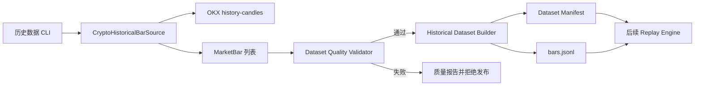

# Loot Crypto 历史数据集与 Replay 数据基座 V0.1

| 属性 | 值 |
|---|---|
| 状态 | Accepted for implementation |
| 实现状态 | In Progress |
| 版本 | 0.1 |
| 日期 | 2026-08-06 |
| 需求 | REQ-0018 |

## 1. 问题与目标

现有 `CryptoMarketDataProvider` 面向 Worker 的短窗口读取，能够证明行情输入和决策链路按契约
运行，但不能支撑一年 BTC H1 数据的完整性校验、跨设备复现和规则对照 Replay。

本设计的目标是先建立研究输入地基：

- 从 OKX 公共历史 K 线接口分页读取指定闭合区间的 BTC H1 数据。
- 继续使用生产 `MarketBar` 作为单根行情事实，不维护研究专用 K 线模型。
- 为数据集生成确定性 identity、内容摘要、manifest 和质量报告。
- 将原始行情采集与后续 Replay、Outcome Label、V0.2 特征研究解耦。
- 数据缺失、重复、未闭合或身份漂移时明确失败，不让不完整样本进入统计结论。

## 2. 非目标

- 本阶段不实现 V0.2 规则、Outcome Label、收益指标或运行时默认规则切换。
- 不把一年 K 线写入生产 Signal、Proposal、Ticket 或监控 Run 表。
- 不接入 Agent、LLM、自动交易、账户接口、新闻、Funding、OI 或清算数据。
- 不在 Git 中提交一年原始数据；仓库只提交契约、采集器、校验器和可重复命令。
- 不为 US Equity 或 A-Share 提前抽象市场业务规则。

## 3. 方案评估

### 3.1 方案 A：扩展生产 Provider 统一端口

给 `CryptoMarketDataProvider` 增加一年历史区间读取。接口数量最少，但所有 Worker Fake、测试替身
和后续实时 Provider 都被迫实现研究能力，扩大生产端口职责，不采用。

### 3.2 方案 B：独立 Historical Source 与 Dataset Builder

保留生产短窗口端口，新增结构化的 `CryptoHistoricalBarSource`；OKX 实现复用现有 MarketBar
归一化规则，Dataset Builder 负责质量门禁和内容寻址。Replay 只读取数据集，不直接访问网络。

该方案职责清晰，能够独立测试分页、数据质量和文件恢复，是本阶段采用方案。

### 3.3 方案 C：直接落 PostgreSQL 行情事实表

数据库适合后续多数据集修正、查询和长期运行，但当前尚未冻结修正版本与 ReplayRun Schema。
此时先建表会把研究输入和生产事实生命周期过早绑定，本阶段延期。

## 4. 组件边界



- `loot.contracts.replay`：数据集 manifest 与质量报告强类型契约。
- `loot.replay.dataset`：连续性校验、确定性身份、文件写入和恢复。
- `loot.domains.crypto.market_data.OkxRestCryptoProvider`：实现只读历史分页方法，但不把该
  方法加入生产 `CryptoMarketDataProvider` Protocol。
- `scripts/fetch_crypto_history.py`：显式参数化采集入口，只输出脱敏结果摘要。

## 5. 时间区间语义

调用方传入 `start_bar_closed_at` 和 `end_bar_closed_at`，两端都包含在目标区间内。V0.1 只接受
UTC 整点 H1：

```text
expected_count = (end_bar_closed_at - start_bar_closed_at) / 1 hour + 1
bar.opened_at = bar.closed_at - 1 hour
```

OKX `history-candles` 返回按时间倒序排列的数据；`after` 表示读取早于指定时间戳的记录，单页
最大 300 条。采集器从 `end_bar_closed_at` 向过去翻页，以每页最旧 `opened_at` 作为下一页游标，
直到覆盖 `start_bar_closed_at`。接口当前按 IP 限制 20 次/2 秒，默认页间隔不小于 0.11 秒。

官方语义来源：[OKX Candlesticks history](https://www.okx.com/docs-v5/en/#rest-api-market-data-get-candlesticks-history)。

## 6. 数据质量门禁

质量报告至少记录：

- 请求区间和预期 K 线数量。
- 实际数量、首尾闭合时间。
- 缺失 `closed_at`。
- 重复 `provider_event_id`。
- 重复 `closed_at`。
- 未闭合 K 线。
- 与目标 market、instrument、provider、timeframe 不一致的 K 线。
- 是否通过发布门禁。

质量检查先收集问题再给出报告；只有报告通过时才能生成 manifest。`MarketBar` 自身继续负责
UTC、OHLCV、闭合时钟和基础身份校验。

## 7. 数据集身份

数据集内容摘要复用 `MarketSnapshot` 的 canonical 行情指纹规则：包含 Provider、标的、周期和
有序完整 K 线事实，排除 `received_at`、manifest 生成时间和派生 UUID。因此同一历史区间重抓
且行情事实未变化时身份稳定；Provider 修正 OHLCV、成交量、闭合状态或事件身份时摘要变化。

```text
dataset_key = crypto.market-bars.v1
              + provider
              + instrument_id
              + timeframe
              + start_bar_closed_at
              + end_bar_closed_at
              + content_hash

dataset_id = UUIDv5(dataset_key)
```

manifest 固定记录 `schema_version=crypto.market-bars.v1`、数据身份、请求区间、实际首尾、数量、
内容摘要和生成时间。生成时间只用于审计，不进入 identity。

## 8. 文件工件

默认输出到 `data/replay/<dataset_id>/`：

- `manifest.json`：数据集身份与区间元数据。
- `quality-report.json`：完整性检查结果。
- `bars.jsonl`：按 `opened_at` 升序保存 canonical MarketBar JSON，每行一根。

写入使用临时文件加原子替换；读取时重新运行 MarketBar 契约、质量检查和内容摘要验证。目录
加入 `.gitignore`，跨设备复现依赖相同命令和 manifest，而不是依赖开发机未说明的缓存。

## 9. 错误与恢复

- Provider 返回错误码、空页或游标不前进：抛出 `CryptoProviderError`，不发布数据集。
- 请求区间未完整覆盖：保留质量报告，CLI 返回非零，不生成通过状态 manifest。
- 相同目标重复执行：相同内容写入相同 `dataset_id` 目录，可以安全覆盖同内容工件。
- 同区间内容被 Provider 修正：生成新的 `dataset_id`，旧目录不被静默覆盖。
- CLI 不打印原始 Provider payload、数据库连接或账户信息。

## 10. 测试与阶段出口

- 单元测试覆盖完整区间、缺失、重复、未闭合、身份不一致和重抓时钟漂移。
- Provider 测试使用注入 HTTP 响应验证倒序分页、游标推进、去重和区间裁剪。
- 文件测试验证写入后读取得到相同 manifest、质量报告和 K 线内容。
- Live smoke 使用 BTC-USDT H1 小区间验证真实 OKX 响应；一年采集作为阶段验收命令执行。
- 本切片完成只代表“历史输入可复现”，不代表 V0.1 或 V0.2 已证明有效。
