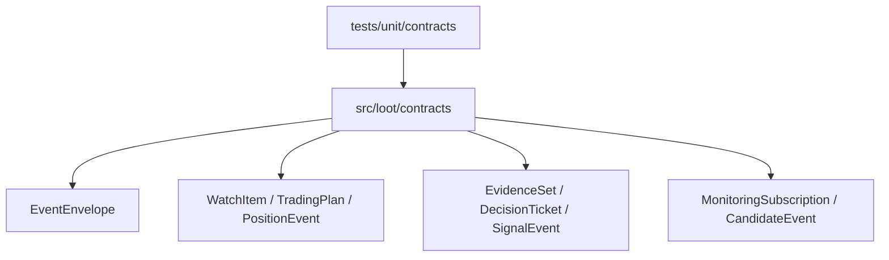

# 2026-07-10 核心契约骨架

## 背景

- Loot 已完成文档分层和上下文维护机制，可以开始 Phase 0 架构基础。
- 按 `AGENTS.md` 约束，不能先从 UI 或 Agent 开始，必须先定义跨模块契约。
- 当前最小实现目标是让 Platform、Market Domain、Signal、Alert 未来共享稳定的枚举、事件信封和核心数据结构。

## 目标

- 建立 Python 项目骨架。
- 定义第一批强类型 contracts。
- 为契约增加不依赖 pytest 的单元测试。
- 不实现数据库、API、Agent、Skill Runtime 或 Signal State Machine。

## 开发结构图



## 判断过程

- 使用 Pydantic v2 作为强类型契约基础，符合技术方向中的 Python + Pydantic。
- 契约模型设置为不可变并禁止额外字段，避免生产者和消费者之间悄悄漂移。
- 时间字段要求 timezone-aware，并归一化为 UTC，提前落实全局 UTC 约束。
- 生命周期时间顺序在契约层直接校验，避免后续消费者接收到已经倒序的状态事实。
- 测试先使用 `unittest`，因为当前 Python 3.12 环境已有 Pydantic 但没有 pytest。
- `PositionEvent` 保持 OPEN、ADD、REDUCE、MOVE_STOP、CLOSE；TradingPlan 取消不进入 PositionEvent。
- `TradingPlan`、`Position`、`CandidateEvent`、`EvidenceSet`、`DecisionTicket`、`SignalInstance` 补充时间顺序约束。
- 参考 `code-standards` Java 注释规范，把业务五要素、调用链和决策注释迁移为
  Python docstring 规则，避免核心契约只留下技术描述。

## 改动点

- 新增 `pyproject.toml`。
- 新增 `.Codex-standards.md`，固定 Loot Python 代码的业务 docstring 规则。
- 补充 `.gitignore` 的 Python 缓存、构建产物、虚拟环境和 IDE 元数据规则。
- 新增 `src/loot/__init__.py`。
- 新增 `src/loot/contracts/`：
  - `base.py`
  - `enums.py`
  - `events.py`
  - `market.py`
  - `portfolio.py`
  - `monitoring.py`
  - `signals.py`
- 为核心 contracts 补充中文业务 docstring，覆盖业务描述、场景、调用链和规则。
- 为关键 validator 补充业务决策注释，说明为什么要拦截时间倒序、状态无变化、
  缺少幂等键或缺少成交字段。
- 新增 `tests/unit/contracts/test_contracts.py`。
- 新增 `docs/architecture/contracts/loot-contracts-v0.1.md`。

## 验证

```powershell
$env:PYTHONPATH='D:\my-projects\Loot\src'
py -3.12 -m unittest discover -s tests -p 'test_*.py'
```

结果：

```text
Ran 12 tests
OK
```

```bash
py -3.12 -m compileall src tests
```

结果：通过。

```bash
git diff --check
```

结果：通过。

## 发现的问题

- 当前环境 Python 3.12 没有安装 pytest，因此第一批测试使用标准库 `unittest`。
- Signal State Machine 还没有实现，当前只验证 SignalEvent 必须表达状态变化。
- Skill Manifest、SkillRun 和 Guard 输出仍缺契约。

## 后续

- 设计并实现 Signal State Machine 最小版本。
- 增加合法迁移表和重复 DecisionTicket 消费语义。
- 做 FakeProvider 和 FakePreFilter，为第一条 Crypto 闭环准备输入。
