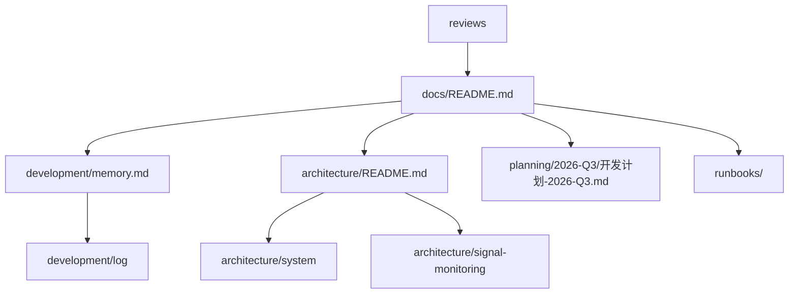

# 2026-07-10 设计上下文分层与维护机制

## 背景

- Loot 当前处于架构设计阶段，生产代码还没有启动。
- 初始设计文档已经包含宏观架构和自选持仓信号监控闭环，但缺少可持续的上下文恢复机制。
- 参考项目 `D:\YLWX-project\PythonProject` 已经形成 `architecture / development / planning / reviews / runbooks` 的分层方式，适合迁移到 Loot。

## 目标

- 建立 Codex 后续接手时的固定阅读入口。
- 把长期架构、当前状态、过程推理、阶段结论和可重复操作分开。
- 让每轮 vibe coding 结束后知道该更新哪类上下文。
- 不开始生产代码实现。

## 开发结构图

## 判断过程

- `architecture` 只保存稳定设计，不承载每日状态。
- `memory.md` 只做当前状态仪表盘，避免膨胀成第二份架构文档。
- `development/log` 保存为什么这样判断、放弃过什么、验证过什么。
- `reviews` 保存阶段结论和复核清单，避免风险散落在聊天里。
- `runbooks` 保存可执行命令和检查流程。
- `AGENTS.md` 负责把这些入口和硬约束写给未来 Codex。

## 改动点

- 新增 `docs/README.md` 和 `docs/architecture/README.md`。
- 将宏观设计归入 `docs/architecture/system/loot-system-architecture-v0.1.md`。
- 将第一条功能闭环设计归入 `docs/architecture/signal-monitoring/signal-monitoring-loop-design-v0.1.md`。
- 新增 `docs/development/memory.md`、`docs/development/log/README.md`、`docs/development/log/TEMPLATE.md`。
- 新增评审文档，现归档为
  `docs/reviews/2026-Q3/loot-design-layering-review-2026-07-10.md`。
- 新增 `docs/runbooks/local-run.md` 和 `docs/runbooks/context-health-check.md`。
- 更新根 `AGENTS.md`，加入上下文收尾归档动作。

## 验证

- `py main.py`：输出 `Hi, PyCharm`。
- `git diff --cached --check`：文档暂存区格式检查通过。

## 发现的问题

- 当前仓库仍是 PyCharm 示例脚本，没有正式 Python 项目骨架。
- contracts 还没有独立设计文档，下一步编码前需要先收敛。
- Signal State Machine 的统一引擎和市场 TransitionPolicy 职责还需要在实现前再次钉死。

## 后续

- 建立 `docs/architecture/contracts/` 或对应组件级契约设计。
- 再创建 Python 项目骨架。
- 第一条可运行闭环优先用 FakeProvider 和 Golden Case 验证。
