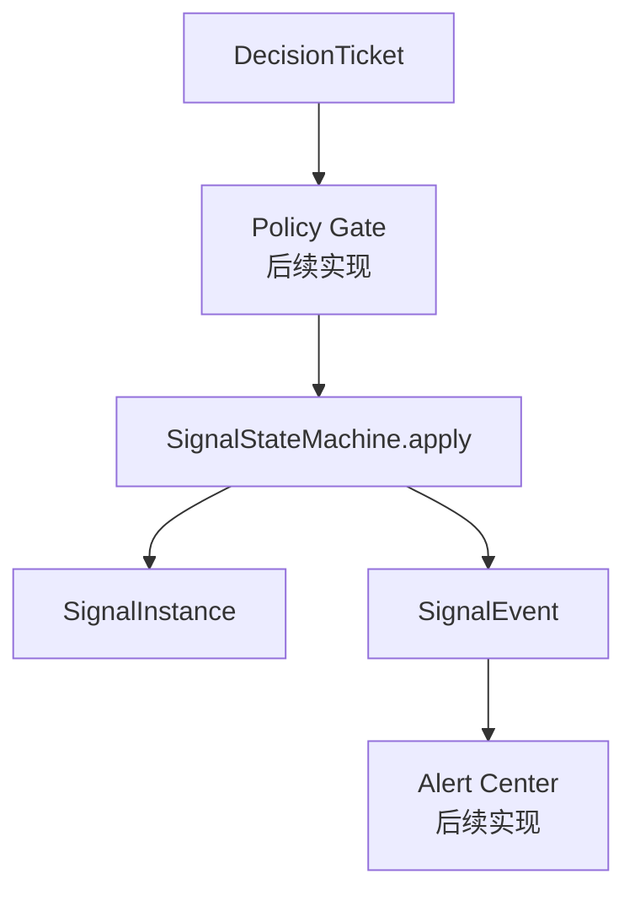

# 2026-07-10 Signal State Machine v0.1

## 背景

- 核心 contracts 已建立，下一步需要先把 Signal 状态事实入口立住。
- 架构约束要求 Agent 不能直接写 Signal，状态变化必须经过 Policy Gate 和
  Signal State Machine。
- 当前尚未接数据库，因此先用内存幂等账本验证状态机语义。

## 目标

- 实现 Signal State Machine 最小版本。
- 固定 V0.1 合法迁移表。
- 覆盖合法迁移、非法迁移、重复 DecisionTicket、同状态 no-op 和身份不一致。
- 补充状态机架构文档和上下文索引。

## 结构图



## 判断过程

- 状态机先放在 `src/loot/signals`，区别于 `src/loot/contracts/signals.py`：
  contracts 只定义数据契约，signals runtime 执行状态迁移。
- V0.1 不引入数据库 Repository，避免在状态机语义未稳定前混入持久化复杂度。
- 重复消费以 `decision_ticket.id` 为内存幂等键；未来替换为数据库唯一约束。
- `suggested_transition == current_signal.state` 视为 no-op，不发布事件，避免重复提醒。
- 当前合法迁移表直接来自 signal-monitoring 设计文档，不新增隐含迁移。

## 改动点

- 新增 `src/loot/signals/state_machine.py`。
- 新增 `SignalStateMachine`、`SignalTransitionResult` 和状态机错误类型。
- 新增 `tests/unit/signals/test_state_machine.py`。
- 新增状态机架构文档 `docs/architecture/signal-state-machine/loot-signal-state-machine-v0.1.md`。
- 更新文档入口、architecture 索引、memory、planning 和 local-run。

## 验证

```powershell
$env:PYTHONPATH='D:\my-projects\Loot\src'
py -3.12 -m unittest discover -s tests -p 'test_*.py'
```

结果：

```text
Ran 17 tests
OK
```

```bash
py -3.12 -m compileall src tests
```

结果：通过。

```bash
git diff --check
```

结果：通过。

```bash
py main.py
```

结果：输出 `Hi, PyCharm`。

## 发现的问题

- 当前状态机幂等只在单进程内存有效，不能代表未来数据库事务语义。
- `DecisionTicket` 还没有 priority 字段，因此 `SignalEvent.priority` 当前沿用
  `SignalInstance.priority`。
- Policy Gate 仍未实现；测试默认传入的 `DecisionTicket` 已经是准入后的票据。

## 当时遗留事项（历史快照）

- 接入 FakeProvider 和 FakePreFilter，准备第一条 Candidate 到 Signal 的闭环。
- 设计持久化层时补 `signal_transition`、`decision_ticket` 消费标记和 outbox。
- 增加 Golden Case，覆盖重复 DecisionTicket 不重复迁移和不重复提醒。
