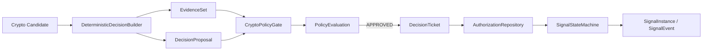

# 2026-07-16 REQ-0007 Crypto Candidate 到 Signal 授权链路

## 背景

- Crypto Provider、Golden Case 和 PreFilter 已能稳定产生带 LONG/SHORT 的 Candidate。
- 旧 Python `DecisionTicket` 实际表达 Policy 前建议，无法从类型判断是否已经授权。
- Signal State Machine 只校验传入 Ticket 字段，没有从事实源核验 Policy 授权链。

## 目标

- 建立 Candidate、Evidence、Proposal、Evaluation、Ticket、Signal 的最小可执行链路。
- 保证 direction、摘要、Signal 版本和业务上下文版本不可被 Policy 或调用方改写。
- 使用内存适配器固定 Phase 0 语义，不在本需求落 PostgreSQL、Outbox、Agent 或 Alert。

## 开发结构图

## 判断过程

- 直接给旧 Ticket 增加 approved 字段仍会保留同名双语义，无法形成权限边界，因此将旧
  类型整体迁移为 `DecisionProposal`，再定义 Policy 后 `DecisionTicket`。
- 状态机如果只校验调用方对象，测试或未来消费者仍可伪造 Ticket，因此增加
  `AuthorizationRepository` 读取端口，并由内存适配器保存三段不可变事实。
- DEFERRED 不能以 proposal_id 永久去重；评估身份绑定 Policy 版本与
  evaluation_context_digest，新请求在数据恢复或允许时间到达后追加 attempt。
- 市场结构 Signal identity 包含 direction，但不包含 Position；Position 只进入版本上下文、
  可操作性和提醒语义。

## 改动点

- 新增 `DecisionProposal`、`PolicyEvaluation`、`PolicyGuardResult`、Policy 后
  `DecisionTicket`，并让 Evidence、Signal、SignalEvent 显式携带 direction。
- 新增 Crypto 确定性 Builder 和三态最小 Policy Gate。
- 新增授权仓库读写端口和单进程内存适配器，固定 evaluation request、评估身份和
  Proposal 唯一 Ticket 约束。
- Signal State Machine 新增 OBSERVING 幂等初始化、终态后 generation + 1、授权链回查、
  Ticket 有效期、Signal 版本和业务上下文校验。
- SignalEvent 直接保留 Candidate、Proposal、Evaluation、Ticket 和 Snapshot 引用。

## 验证

- Windows PowerShell，Codex bundled Python 3.12.13。
- `PYTHONPATH=src python -m unittest discover -s tests -p 'test_*.py' -v`：63 个测试通过。
- `python -m compileall -q src tests scripts`：通过。
- PyCharm MCP：修改后的 Python 文件完成 reformat、build 和 inspections；项目解释器未
  解析到 Pydantic，契约文件出现环境型 unresolved import，bundled Python 实际导入、
  编译和测试均通过。
- `python scripts/check_context.py`：通过；52 个 Markdown、134 个本地链接，Skill 镜像一致。

## 发现的问题

- Phase 0 内存仓库只能验证单进程语义，不提供并发原子性、跨进程恢复或崩溃一致性。
- Policy Guard 当前是 Crypto 结构突破最小集合，不代表完整 Instrument、TradingPlan 或
  Position Policy。

## 当时遗留事项（历史快照）

- 数据库事务、唯一约束、Inbox、Outbox、乐观锁和重启恢复由
  [REQ-0008](../../../planning/2026-Q3/需求管理-2026-Q3.md#req-0008crypto-决策链路持久化可靠性基线)
  负责。
