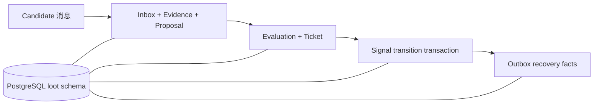

# 2026-07-17 REQ-0008 PostgreSQL 持久化基线

## 背景

- REQ-0007 的授权事实、Signal projection 和 Ticket 消费账本仅存在于单进程内存。
- REQ-0008 需要建立跨进程恢复、至少一次投递、并发 generation 和 Outbox 原子性的数据库地基。
- 初版使用 Alembic Python migration，但实际操作以 DBX 为主，用户决定将版本文件收敛为
  可直接执行的 SQL。

## 目标

- 固定 10 张 PostgreSQL 业务表及事务、唯一性和恢复语义。
- 实现 Analysis、Policy、Authorization、Signal 和 Outbox 的数据库适配器。
- 优先在 `loot_test` 通过 `loot_app` 真实连接验收。
- 本阶段不接 Alert dispatcher、Redis Streams、Agent 或其他市场。

## 开发结构图

## 判断过程

- PostgreSQL 作为唯一业务事实源；Redis 和进程内字典不能承担最终唯一约束。
- Signal 初次 generation 没有可锁行，因此使用监控身份 advisory lock；Ticket 消费使用
  Ticket advisory lock、Signal 行锁和乐观版本共同防止并发重复迁移。
- JSONB 保存完整 Pydantic payload，可索引列服务于约束和查询；读取时重新执行契约校验并
  比较 canonical SHA-256 指纹。
- SQL migration 更符合当前 DBX 操作方式，因此移除 Alembic 脚手架，避免同时维护两套入口。

## 改动点

- 新增 canonical serialization、SQLAlchemy metadata 和 PostgreSQL Engine 工厂。
- 新增 Analysis Inbox/Evidence/Proposal、授权事实、Outbox 和 Signal workflow。
- 新增 10 张表、7 个显式索引、70 个命名约束的事务型 SQL migration。
- 新增 PostgreSQL 端到端测试，覆盖 Analysis 重投、Policy 授权、Signal 迁移、进程重建后
  Ticket 重复消费和冲突 payload。
- 修复集成测试遗漏 Inbox 清理的问题，测试后 10 张表恢复为空。

## 验证

- DBX：`loot_test.loot` 下 10 张表存在。
- DBX 专用连接：数据库 `loot_test`，`current_user=loot_app`，`search_path=loot, public`。
- 权限：`loot_app` 对 10 张表具有 SELECT/INSERT/UPDATE/DELETE，schema USAGE=true、
  CREATE=false。
- `LOOT_TEST_DATABASE_URL=<loot_app test DSN> python -m pytest -q`：69 个测试通过。
- `python -m compileall -q src tests`：通过。
- metadata/SQL 静态校验：10 张表、7 个索引、70 个约束名称全部匹配，名称均未超过
  PostgreSQL 63 字节限制。
- 测试后 DBX 查询：10 张业务表行数均为 0。

## 发现的问题

- 第一次真实集成测试后发现 `inbox_messages` 遗留测试记录，根因是 teardown 未清理 Inbox；
  已限定 `integration.crypto-candidate` consumer 并补充中断恢复清理。
- 测试密码强度较低，只能作为临时测试凭据，后续应轮换且不能复制到仓库。

## 当时遗留事项（历史快照）

- `loot_dev` 尚未应用同一 SQL migration；当前需求状态仍为 In Progress。
- Outbox dispatcher、失败重试调度和最小 Replay 属于后续需求，不在本阶段实现。
- 当前执行状态和后续顺序以
  [需求管理 2026-Q3](../../../planning/2026-Q3/需求管理-2026-Q3.md)及
  [memory](../../memory.md)为准。
