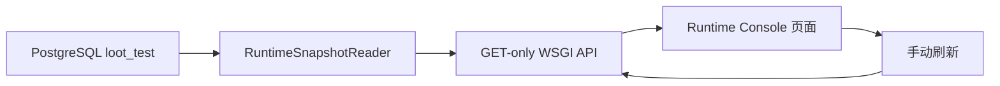

# 2026-07-24 REQ-0017 Crypto Runtime 只读观察台

## 背景

- REQ-0013 已经把 Crypto Run-Once 的决策事实保留在 `loot_test`，但开发者仍需手工打开多张表
  才能确认 Proposal、Policy、Ticket、Signal 和 Outbox 是否完整。
- 当前没有常驻 Worker、Run ledger、Alert Center 或 Replay，观察台不能用静态数据制造“系统正在运行”
  的假象。

## 目标

- 提供一个本地、只读、可视化的 Runtime Console，聚合已有事实并明确能力边界。
- 复用现有 SQLAlchemy Core 和标准库 WSGI，不引入 FastAPI、前端构建链或额外数据库表。

## 开发结构图

## 判断过程

- 观察台只读取 REQ-0013 已落库的决策链、Signal 和未发布 Outbox，不新增运行账本或假 Worker 数据。
- 每次查询先执行 `SET TRANSACTION READ ONLY`，再检查 `current_database()` 必须为 `loot_test`，避免
  本地误连开发库后展示错误事实。
- API 只返回脱敏摘要和关联 ID；Outbox 的 `last_error` 可能包含底层诊断，因此不作为观察台字段返回。
- 复核 WSGI 边界时发现查询参数必须从 `QUERY_STRING` 读取，不能依赖测试中把 query 混入 `PATH_INFO`。

## 改动点

- 新增 `src/loot/observability/runtime_console.py`，实现数据库读模型、错误降级和 GET-only WSGI 路由。
- 新增 `src/loot/observability/static/index.html`，展示概览、能力状态、数据库事实、决策链、Signal 和
  Outbox。
- 新增 `scripts/run_runtime_console.py` 和 `docs/runbooks/local-run.md` 启动入口。
- 新增 Runtime Console 架构文档，并将 REQ-0017、memory 和季度过程总览收尾。
- 单元测试补充数据库不可用、错误数据库、空数据和真实 WSGI query string 场景。

## 验证

- Windows PowerShell，Python 3.12.13：`& .\.venv\Scripts\python.exe -m pytest -q`，98 passed。
- `& .\.venv\Scripts\python.exe -m pytest -q tests\unit\observability`，8 passed。
- `& .\.venv\Scripts\python.exe -m compileall -q src tests scripts migrations`，通过。
- `git diff --check`，通过；仅有 Git 对既有 Markdown 换行格式的提示。
- 真实 `loot_test` HTTP 复核：`/api/overview` 为 healthy，Proposal 1、Signal 1、Outbox 5；
  `/api/outbox?limit=1` 返回 1 条且不含 `last_error`。
- 浏览器复核：桌面端和 390px 移动端均无横向溢出，刷新成功，控制台无 error/warning。

## 发现的问题

- 当前观察台仍是事实查询入口，不代表已经具备常驻运行、失败恢复或告警能力。
- 页面数据依赖 REQ-0013 已落库事实；没有历史数据时会显示空集合，不生成演示数据。

## 当时遗留事项（历史快照）

- 下一步仍按季度需求管理推进 `REQ-0014`，先建立持久化 `WatchItem` 和
  `MonitoringSubscription`，再进入 Worker 和 Alert 需求。
- Worker、Alert、Replay 和 Agent 的观察模型需要在对应需求中独立设计，不能直接扩张当前页面的假设。
