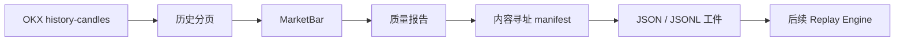

# REQ-0018 Crypto 历史数据集地基

## 背景

现有 `crypto.structure-breakout.v1` 已证明在线行情、决策授权和 Signal 持久化链路可以确定执行，
但没有连续历史输入、结果标签和对照指标，无法证明 LONG/SHORT 具有统计有效性。REQ-0018
因此先于 Alert Center 推进，第一切片先固定 Replay 的输入事实。

## 目标

- 使用生产 `MarketBar` 表达历史 K 线，不复制研究专用行情模型。
- 从 OKX 公共接口读取包含首尾的连续 BTC-USDT H1 区间。
- 数据缺失、重复、未闭合、乱序或 identity 不一致时阻止发布。
- 为通过门禁的数据生成内容寻址 manifest，并支持文件工件跨进程恢复。

## 结构

## 判断过程

没有把历史区间方法加入生产 `CryptoMarketDataProvider` Protocol。Worker 只需要最近和精确目标
短窗口；一年分页、质量报告和文件发布属于研究输入职责。独立历史端口既复用相同 MarketBar
归一化，又避免所有在线 Provider 和测试替身被迫实现研究能力。

Dataset identity 复用 MarketSnapshot 的 canonical 内容指纹，排除 `received_at` 和
`generated_at`。这样正常重抓保持同一身份，而 OHLCV、闭合状态或 Provider 事件身份被修正时
会产生新数据集，不会静默覆盖历史研究输入。

## 改动点

- 新增历史数据集质量报告、manifest、Builder 和防篡改文件加载。
- OKX Provider 新增独立历史 H1 分页，使用 `after` 游标向过去推进并执行 0.11 秒页间隔。
- 新增 `scripts/fetch_crypto_history.py` 与采集 runbook。
- `data/replay/` 作为本地内容寻址工件加入 Git ignore。

## 验证

验证环境：Windows PowerShell，Codex bundled Python 3.12.13，日期 2026-08-06。

- 全量测试：`149 passed in 10.47s`。
- 真实 24 根 smoke：数据集 `55fa5c7e-692c-5b10-861c-da6c662cec20`，加载后质量通过。
- 真实连续 365 天：`8760` 根，数据集 `6b995bda-9b83-5003-9989-feb531c1983d`，
  内容摘要 `a192419d6ccef018201d7bbddca933c68b1184e0db6e8be1643560188d4d3f69`。
- 数据目录处于 Git ignored，没有纳入版本库。

## 发现的问题

- OKX 分页边界可能重复返回相同 K 线；实现按 provider_event_id 去重，并忽略仅采集时钟不同的
  重复事实。相同事件的市场事实冲突仍按 Provider 错误拒绝。
- 当前只建立历史输入地基，尚不能输出命中率、MFE、MAE、1R/2R 或 V0.2 有效性结论。

## 当时遗留事项（历史快照）

本记录形成时，REQ-0018 仍处于 In Progress；Replay Engine、Outcome Label、V0.1 基线报告和
V0.2 单变量研究尚未实现。当前执行顺序以需求管理原条目为准。
