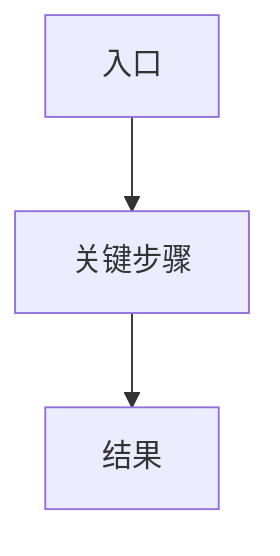

# YYYY-MM-DD 功能点名称

## 背景

- 为什么要做这个功能点。
- 当时遇到了什么问题或约束。

## 目标

- 本次希望达成什么。
- 不做什么。

## 开发结构图

## 判断过程

- 如何定位问题。
- 哪些证据支持这个判断。
- 放弃过哪些方案。

## 改动点

- 改动的代码、配置或文档。
- 关键参数、契约、事件或状态机变化。

## 验证

- 执行过的命令。
- 关键 debug 字段、事件或数据库状态。
- 结果是否符合预期。

## 发现的问题

- 新暴露的问题。
- 后续可能影响开发的风险。

## 当时遗留事项（历史快照）

- 只记录本次结束时尚未解决的判断，不作为当前计划指令。
- 需要继续执行的测试、文档或设计必须链接到需求管理中的对应条目。
